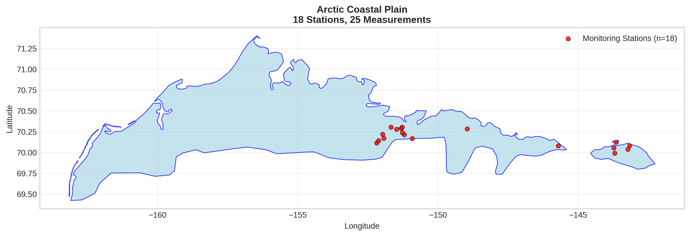
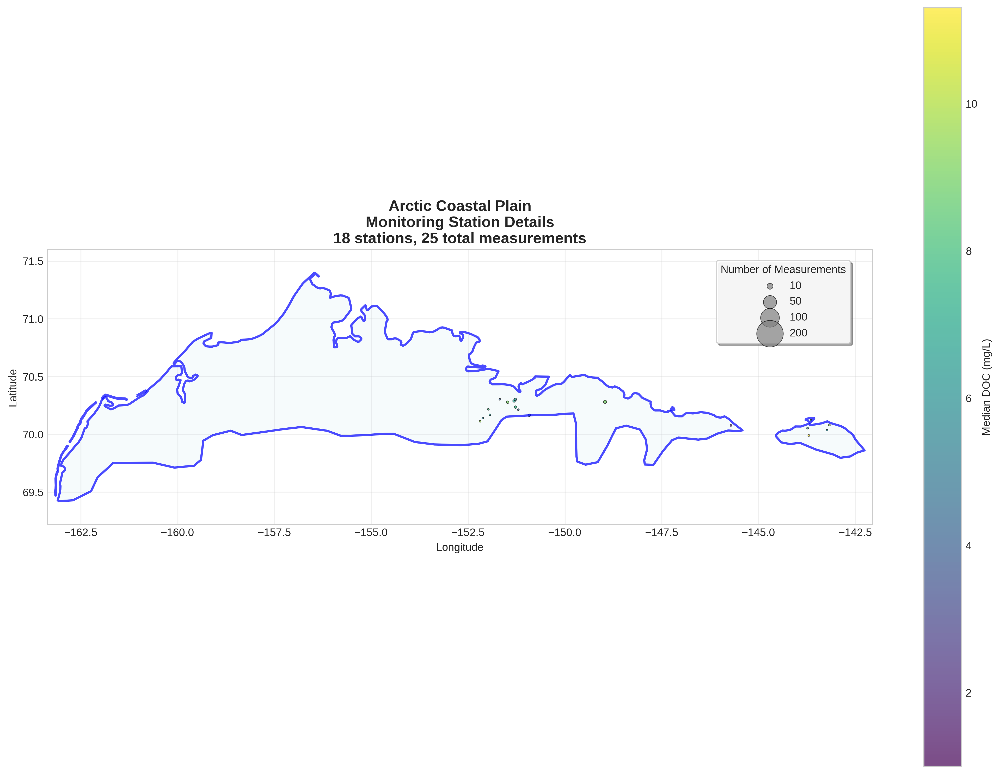
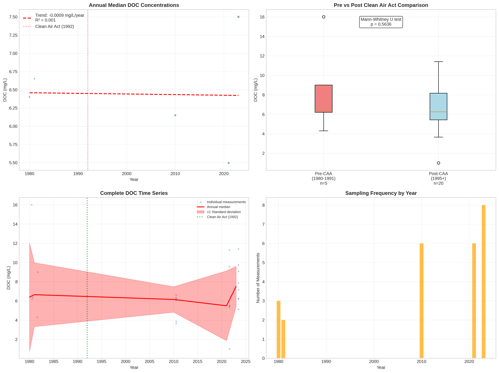

# Arctic Coastal Plain - Detailed DOC Analysis

## Overview
- **Total Measurements**: 25
- **Monitoring Stations**: 18
- **Temporal Coverage**: 1980-2023
- **Median DOC**: 6.25 mg/L
- **Mean DOC**: 7.02 ± 3.04 mg/L

## Spatial Distribution

*Figure 1: Arctic Coastal Plain monitoring stations colored by decade. The blue boundary shows the ecoregion extent with surrounding context.*

## Station Details

*Figure 2: Individual monitoring stations within Arctic Coastal Plain. Marker size indicates number of measurements, color indicates median DOC concentration.*

## Temporal Analysis

*Figure 3: Comprehensive temporal analysis including annual trends, Clean Air Act comparison, seasonal patterns, and data coverage.*

## Statistical Summary

### DOC Distribution
- **Median**: 6.25 mg/L
- **25th Percentile**: 5.46 mg/L  
- **75th Percentile**: 9.00 mg/L
- **Standard Deviation**: 3.04 mg/L

### Clean Air Act Impact Analysis

- **Pre-CAA (1980-1991)**: 6.40 mg/L (n=5)
- **Post-CAA (1995+)**: 6.25 mg/L (n=20)
- **Change**: -2.3%
- **Statistical Test**: Not statistically significant (p = 0.5636)

### Long-term Trend Analysis

- **Trend**: decreasing at -0.0009 mg/L per year
- **R² Value**: 0.001
- **Statistical Significance**: Not statistically significant (p = 0.9683)

---
*Generated on: 2025-08-14 09:55:28*
*Analysis period: 1980-2023*
