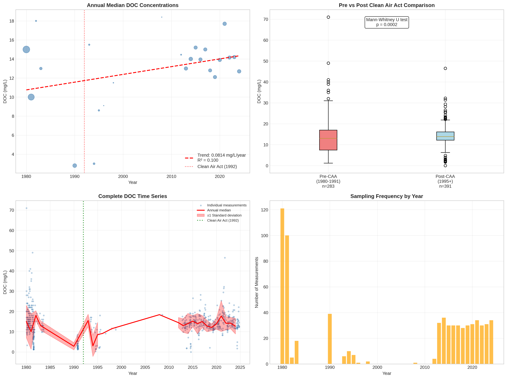

# Aspen Parkland/Northern Glaciated Plains - Detailed DOC Analysis

## Overview
- **Total Measurements**: 690
- **Monitoring Stations**: 87
- **Temporal Coverage**: 1980-2024
- **Median DOC**: 13.60 mg/L
- **Mean DOC**: 13.65 ± 6.63 mg/L

## Spatial Distribution

*Figure 1: Aspen Parkland/Northern Glaciated Plains monitoring stations colored by decade. The blue boundary shows the ecoregion extent with surrounding context.*

## Station Details

*Figure 2: Individual monitoring stations within Aspen Parkland/Northern Glaciated Plains. Marker size indicates number of measurements, color indicates median DOC concentration.*

## Temporal Analysis

*Figure 3: Comprehensive temporal analysis including annual trends, Clean Air Act comparison, seasonal patterns, and data coverage.*

## Statistical Summary

### DOC Distribution
- **Median**: 13.60 mg/L
- **25th Percentile**: 11.00 mg/L  
- **75th Percentile**: 16.10 mg/L
- **Standard Deviation**: 6.63 mg/L

### Clean Air Act Impact Analysis

- **Pre-CAA (1980-1991)**: 13.00 mg/L (n=283)
- **Post-CAA (1995+)**: 13.90 mg/L (n=391)
- **Change**: 6.9%
- **Statistical Test**: **Statistically significant** (p = 0.0002)

### Long-term Trend Analysis

- **Trend**: increasing at 0.0814 mg/L per year
- **R² Value**: 0.100
- **Statistical Significance**: Not statistically significant (p = 0.1327)

---
*Generated on: 2025-08-14 09:54:41*
*Analysis period: 1980-2024*
