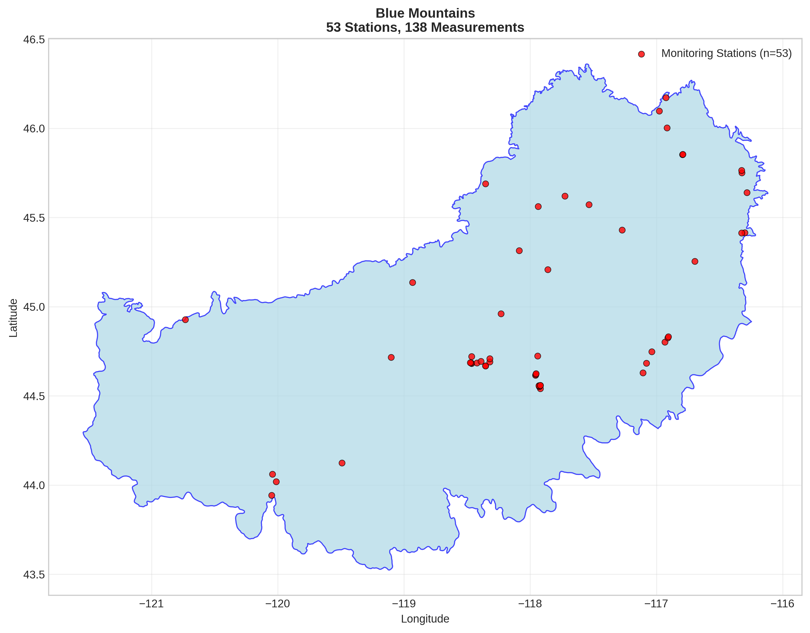
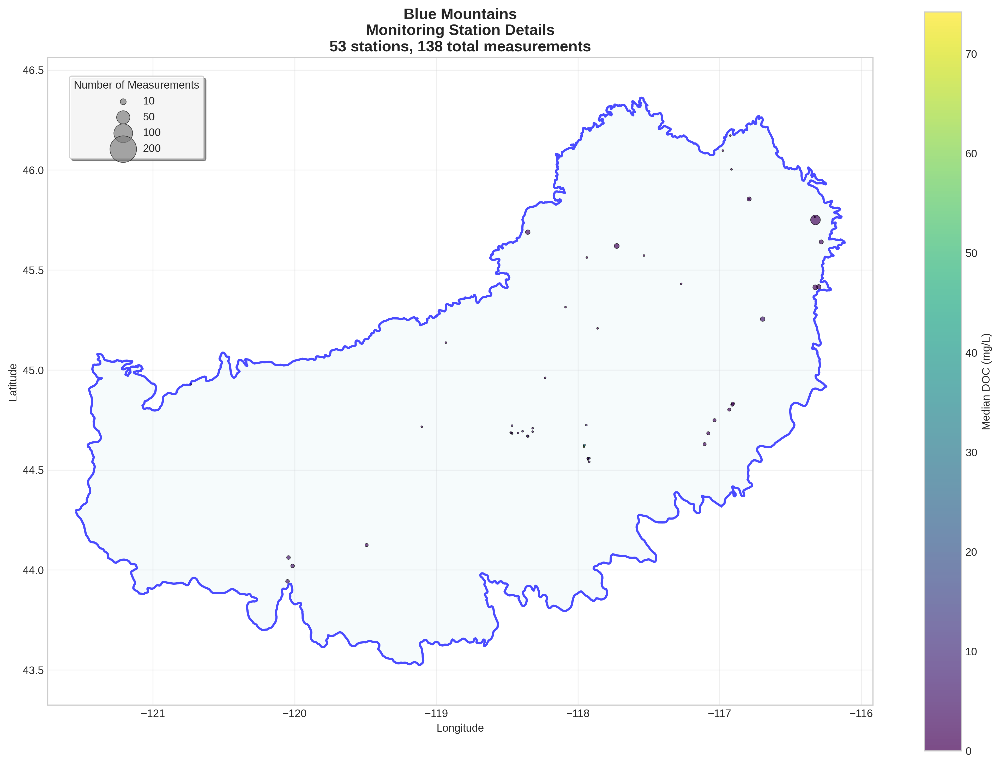
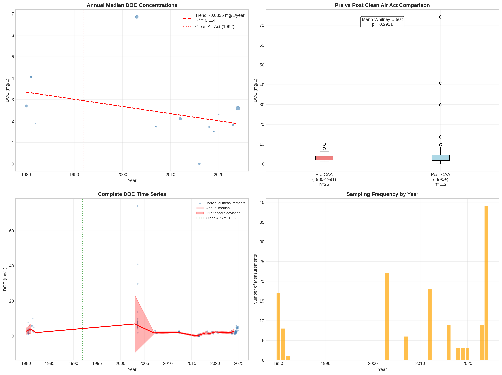

# Blue Mountains - Detailed DOC Analysis

## Overview
- **Total Measurements**: 138
- **Monitoring Stations**: 53
- **Temporal Coverage**: 1980-2024
- **Median DOC**: 2.40 mg/L
- **Mean DOC**: 4.08 ± 7.51 mg/L

## Spatial Distribution

*Figure 1: Blue Mountains monitoring stations colored by decade. The blue boundary shows the ecoregion extent with surrounding context.*

## Station Details

*Figure 2: Individual monitoring stations within Blue Mountains. Marker size indicates number of measurements, color indicates median DOC concentration.*

## Temporal Analysis

*Figure 3: Comprehensive temporal analysis including annual trends, Clean Air Act comparison, seasonal patterns, and data coverage.*

## Statistical Summary

### DOC Distribution
- **Median**: 2.40 mg/L
- **25th Percentile**: 1.74 mg/L  
- **75th Percentile**: 4.43 mg/L
- **Standard Deviation**: 7.51 mg/L

### Clean Air Act Impact Analysis

- **Pre-CAA (1980-1991)**: 3.05 mg/L (n=26)
- **Post-CAA (1995+)**: 2.40 mg/L (n=112)
- **Change**: -21.3%
- **Statistical Test**: Not statistically significant (p = 0.2931)

### Long-term Trend Analysis

- **Trend**: decreasing at -0.0335 mg/L per year
- **R² Value**: 0.114
- **Statistical Significance**: Not statistically significant (p = 0.2826)

---
*Generated on: 2025-08-14 09:55:13*
*Analysis period: 1980-2024*
