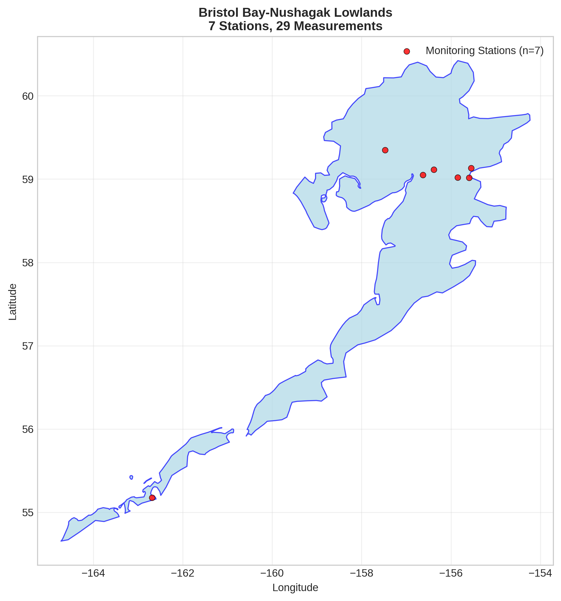
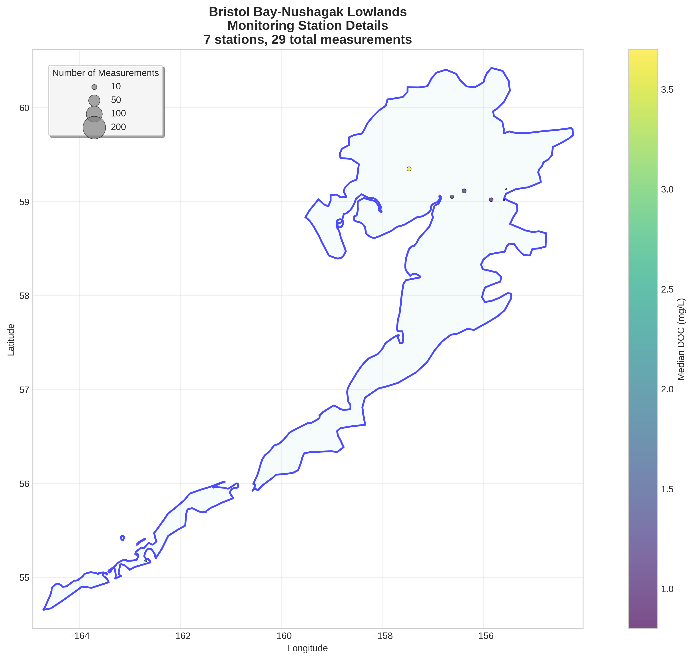
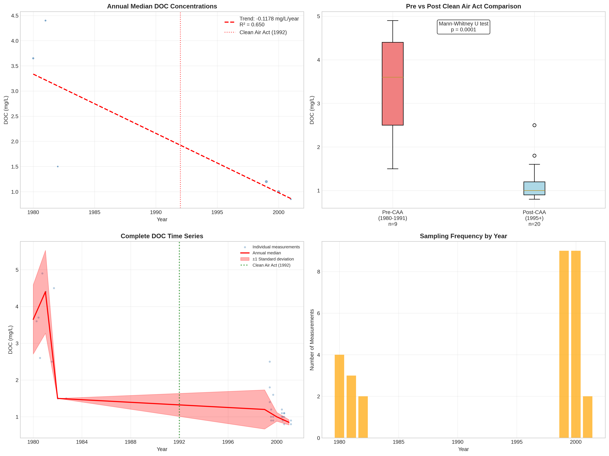

# Bristol Bay-Nushagak Lowlands - Detailed DOC Analysis

## Overview
- **Total Measurements**: 29
- **Monitoring Stations**: 7
- **Temporal Coverage**: 1980-2001
- **Median DOC**: 1.20 mg/L
- **Mean DOC**: 1.81 ± 1.24 mg/L

## Spatial Distribution

*Figure 1: Bristol Bay-Nushagak Lowlands monitoring stations colored by decade. The blue boundary shows the ecoregion extent with surrounding context.*

## Station Details

*Figure 2: Individual monitoring stations within Bristol Bay-Nushagak Lowlands. Marker size indicates number of measurements, color indicates median DOC concentration.*

## Temporal Analysis

*Figure 3: Comprehensive temporal analysis including annual trends, Clean Air Act comparison, seasonal patterns, and data coverage.*

## Statistical Summary

### DOC Distribution
- **Median**: 1.20 mg/L
- **25th Percentile**: 1.00 mg/L  
- **75th Percentile**: 2.50 mg/L
- **Standard Deviation**: 1.24 mg/L

### Clean Air Act Impact Analysis

- **Pre-CAA (1980-1991)**: 3.60 mg/L (n=9)
- **Post-CAA (1995+)**: 1.00 mg/L (n=20)
- **Change**: -72.2%
- **Statistical Test**: **Statistically significant** (p = 0.0001)

### Long-term Trend Analysis

- **Trend**: decreasing at -0.1178 mg/L per year
- **R² Value**: 0.650
- **Statistical Significance**: Not statistically significant (p = 0.0526)

---
*Generated on: 2025-08-14 09:55:25*
*Analysis period: 1980-2001*
