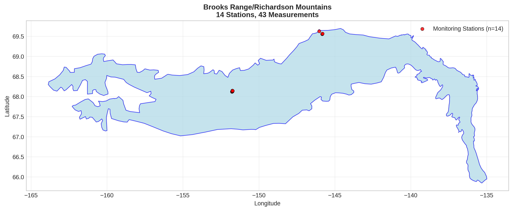
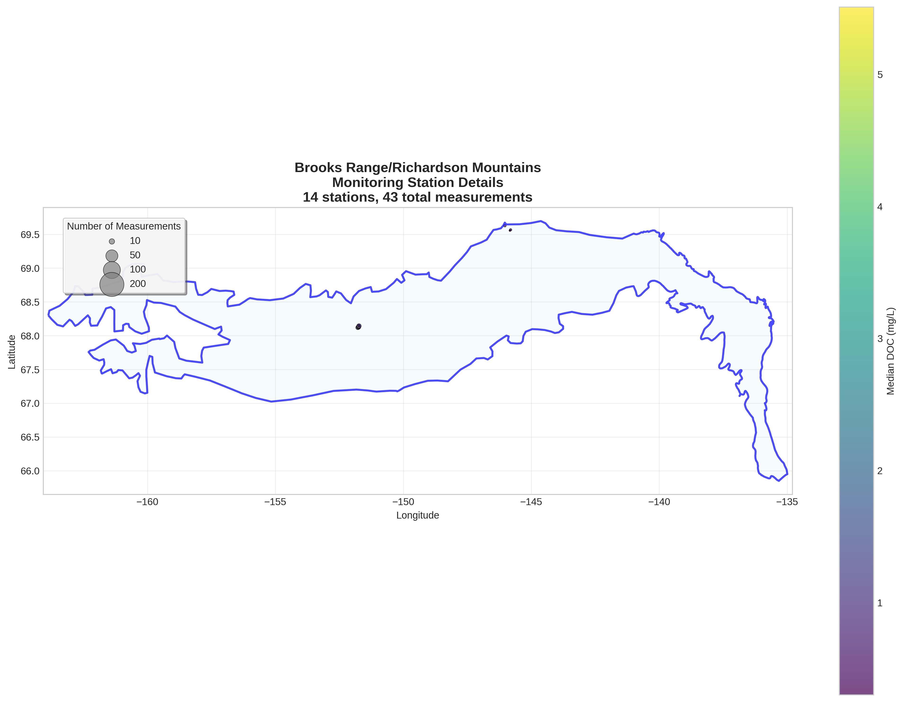
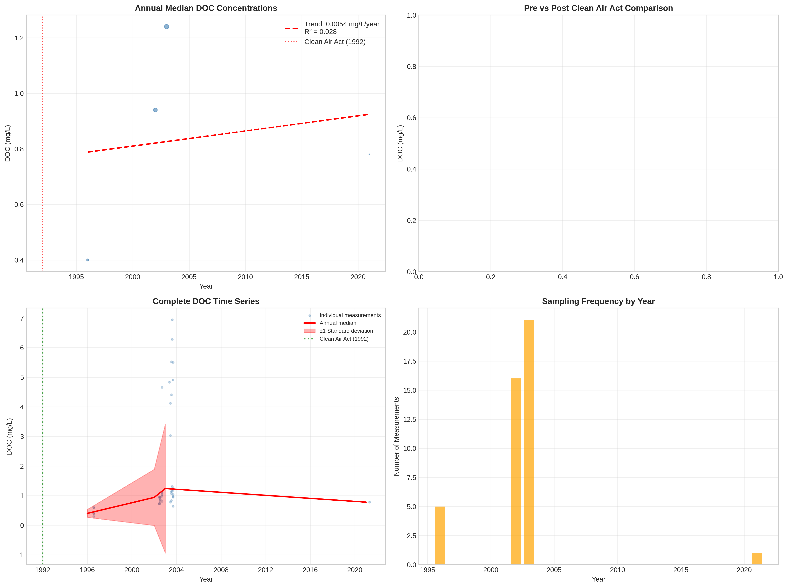

# Brooks Range/Richardson Mountains - Detailed DOC Analysis

## Overview
- **Total Measurements**: 43
- **Monitoring Stations**: 14
- **Temporal Coverage**: 1996-2021
- **Median DOC**: 0.97 mg/L
- **Mean DOC**: 1.84 ± 1.86 mg/L

## Spatial Distribution

*Figure 1: Brooks Range/Richardson Mountains monitoring stations colored by decade. The blue boundary shows the ecoregion extent with surrounding context.*

## Station Details

*Figure 2: Individual monitoring stations within Brooks Range/Richardson Mountains. Marker size indicates number of measurements, color indicates median DOC concentration.*

## Temporal Analysis

*Figure 3: Comprehensive temporal analysis including annual trends, Clean Air Act comparison, seasonal patterns, and data coverage.*

## Statistical Summary

### DOC Distribution
- **Median**: 0.97 mg/L
- **25th Percentile**: 0.79 mg/L  
- **75th Percentile**: 1.27 mg/L
- **Standard Deviation**: 1.86 mg/L

### Long-term Trend Analysis

- **Trend**: increasing at 0.0054 mg/L per year
- **R² Value**: 0.028
- **Statistical Significance**: Not statistically significant (p = 0.8322)

---
*Generated on: 2025-08-14 09:55:21*
*Analysis period: 1980-2021*
