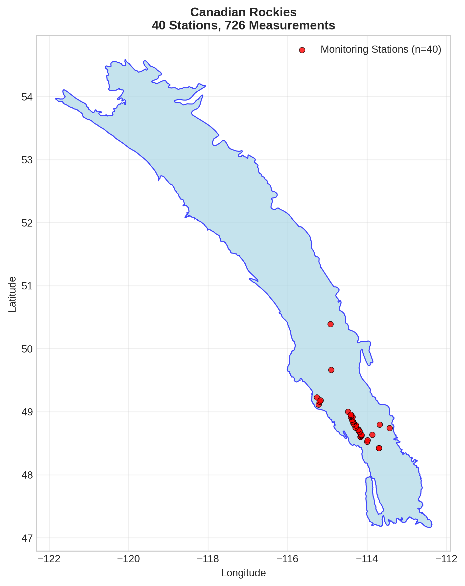
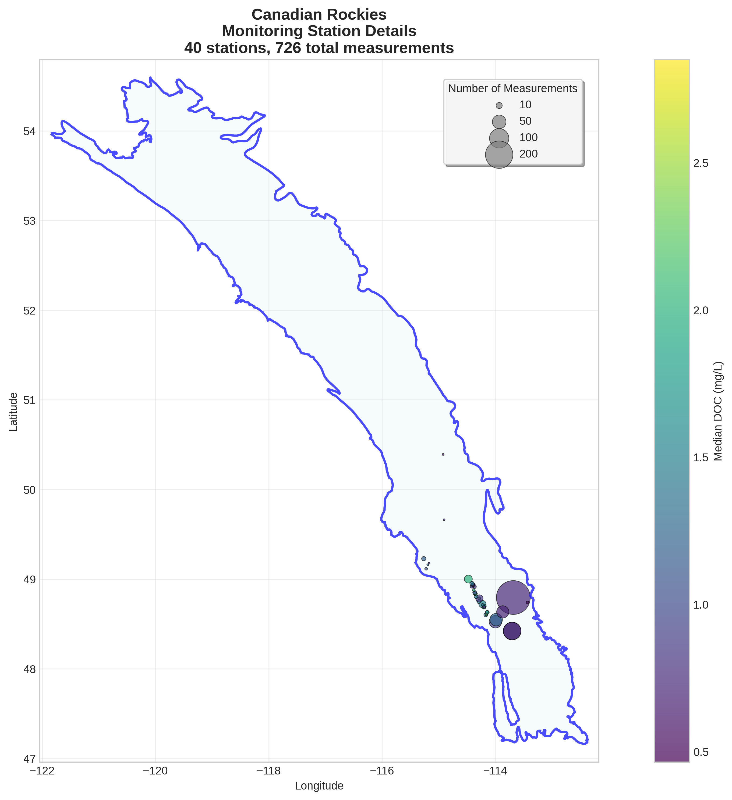
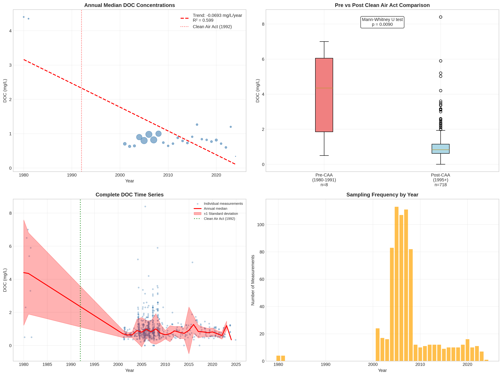

# Canadian Rockies - Detailed DOC Analysis

## Overview
- **Total Measurements**: 726
- **Monitoring Stations**: 40
- **Temporal Coverage**: 1980-2024
- **Median DOC**: 0.83 mg/L
- **Mean DOC**: 1.04 ± 0.79 mg/L

## Spatial Distribution

*Figure 1: Canadian Rockies monitoring stations colored by decade. The blue boundary shows the ecoregion extent with surrounding context.*

## Station Details

*Figure 2: Individual monitoring stations within Canadian Rockies. Marker size indicates number of measurements, color indicates median DOC concentration.*

## Temporal Analysis

*Figure 3: Comprehensive temporal analysis including annual trends, Clean Air Act comparison, seasonal patterns, and data coverage.*

## Statistical Summary

### DOC Distribution
- **Median**: 0.83 mg/L
- **25th Percentile**: 0.62 mg/L  
- **75th Percentile**: 1.19 mg/L
- **Standard Deviation**: 0.79 mg/L

### Clean Air Act Impact Analysis

- **Pre-CAA (1980-1991)**: 4.35 mg/L (n=8)
- **Post-CAA (1995+)**: 0.83 mg/L (n=718)
- **Change**: -80.9%
- **Statistical Test**: **Statistically significant** (p = 0.0090)

### Long-term Trend Analysis

- **Trend**: decreasing at -0.0693 mg/L per year
- **R² Value**: 0.599
- **Statistical Significance**: **Statistically significant** (p = 0.0000)

---
*Generated on: 2025-08-14 09:54:39*
*Analysis period: 1980-2024*
