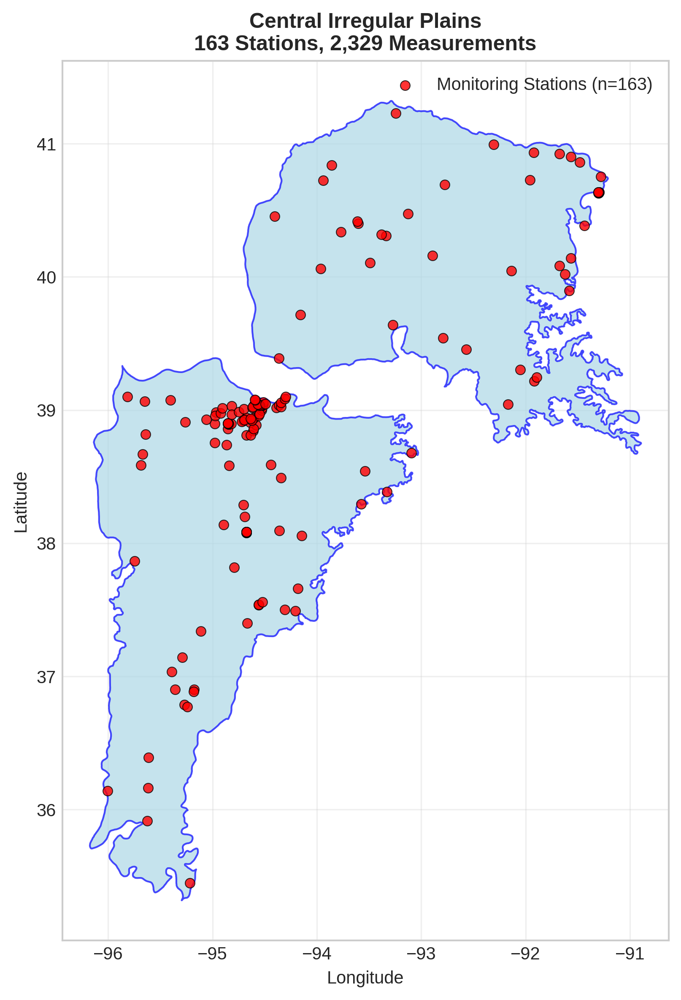
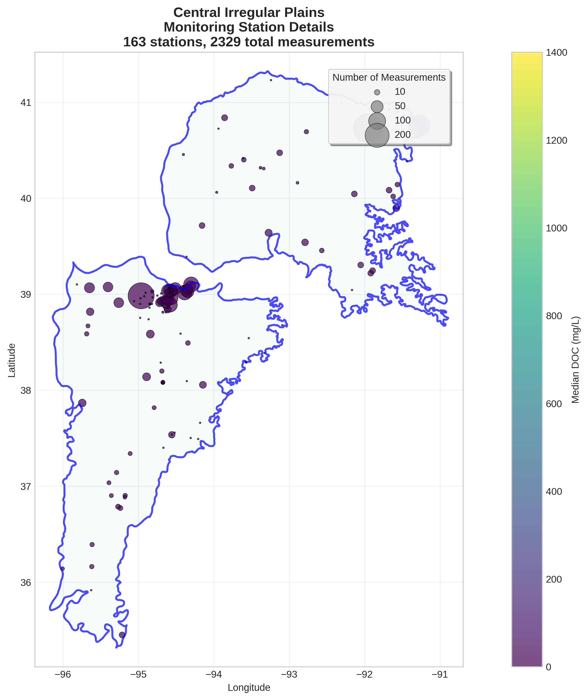
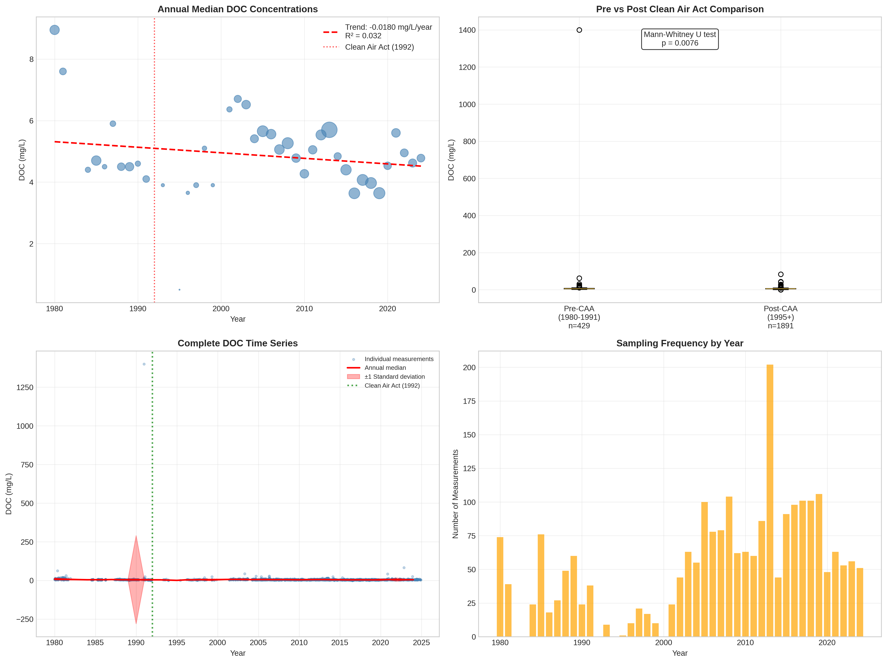

# Central Irregular Plains - Detailed DOC Analysis

## Overview
- **Total Measurements**: 2,329
- **Monitoring Stations**: 163
- **Temporal Coverage**: 1980-2024
- **Median DOC**: 4.90 mg/L
- **Mean DOC**: 6.14 ± 29.10 mg/L

## Spatial Distribution

*Figure 1: Central Irregular Plains monitoring stations colored by decade. The blue boundary shows the ecoregion extent with surrounding context.*

## Station Details

*Figure 2: Individual monitoring stations within Central Irregular Plains. Marker size indicates number of measurements, color indicates median DOC concentration.*

## Temporal Analysis

*Figure 3: Comprehensive temporal analysis including annual trends, Clean Air Act comparison, seasonal patterns, and data coverage.*

## Statistical Summary

### DOC Distribution
- **Median**: 4.90 mg/L
- **25th Percentile**: 3.97 mg/L  
- **75th Percentile**: 6.24 mg/L
- **Standard Deviation**: 29.10 mg/L

### Clean Air Act Impact Analysis

- **Pre-CAA (1980-1991)**: 4.90 mg/L (n=429)
- **Post-CAA (1995+)**: 4.90 mg/L (n=1891)
- **Change**: 0.0%
- **Statistical Test**: **Statistically significant** (p = 0.0076)

### Long-term Trend Analysis

- **Trend**: decreasing at -0.0180 mg/L per year
- **R² Value**: 0.032
- **Statistical Significance**: Not statistically significant (p = 0.2692)

---
*Generated on: 2025-08-14 09:54:01*
*Analysis period: 1980-2024*
