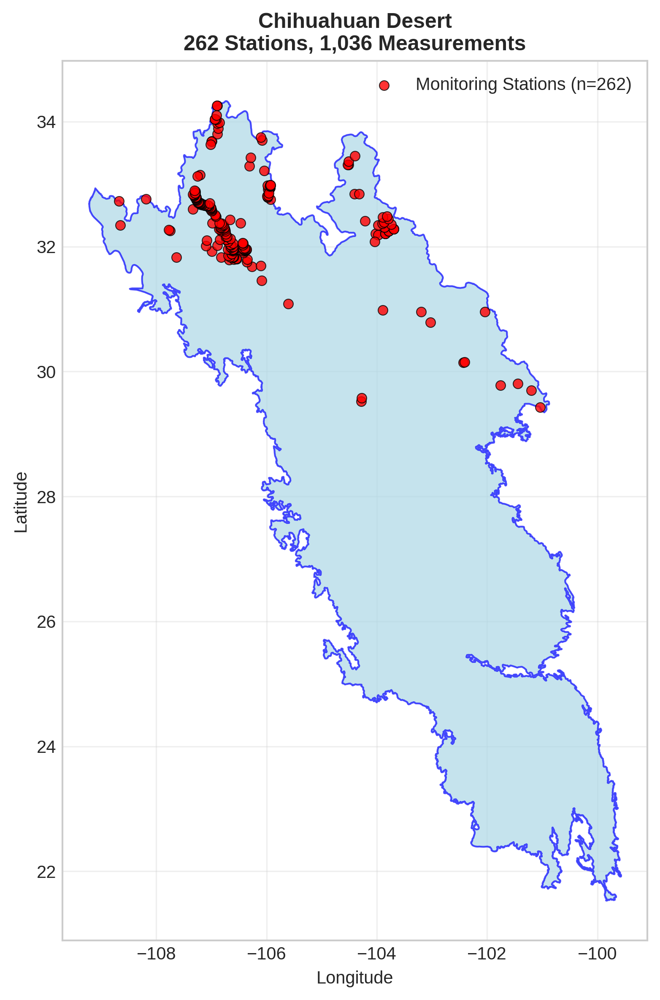
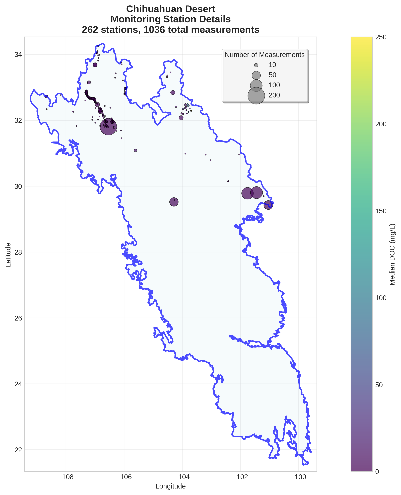
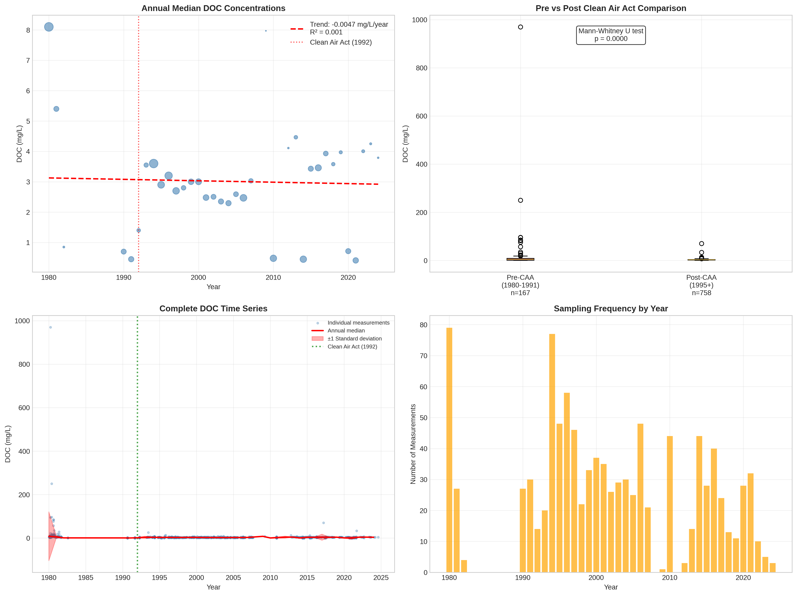

# Chihuahuan Desert - Detailed DOC Analysis

## Overview
- **Total Measurements**: 1,036
- **Monitoring Stations**: 262
- **Temporal Coverage**: 1980-2024
- **Median DOC**: 3.10 mg/L
- **Mean DOC**: 4.98 ± 31.77 mg/L

## Spatial Distribution

*Figure 1: Chihuahuan Desert monitoring stations colored by decade. The blue boundary shows the ecoregion extent with surrounding context.*

## Station Details

*Figure 2: Individual monitoring stations within Chihuahuan Desert. Marker size indicates number of measurements, color indicates median DOC concentration.*

## Temporal Analysis

*Figure 3: Comprehensive temporal analysis including annual trends, Clean Air Act comparison, seasonal patterns, and data coverage.*

## Statistical Summary

### DOC Distribution
- **Median**: 3.10 mg/L
- **25th Percentile**: 1.60 mg/L  
- **75th Percentile**: 4.10 mg/L
- **Standard Deviation**: 31.77 mg/L

### Clean Air Act Impact Analysis

- **Pre-CAA (1980-1991)**: 4.50 mg/L (n=167)
- **Post-CAA (1995+)**: 2.75 mg/L (n=758)
- **Change**: -39.0%
- **Statistical Test**: **Statistically significant** (p = 0.0000)

### Long-term Trend Analysis

- **Trend**: decreasing at -0.0047 mg/L per year
- **R² Value**: 0.001
- **Statistical Significance**: Not statistically significant (p = 0.8506)

---
*Generated on: 2025-08-14 09:54:29*
*Analysis period: 1980-2024*
