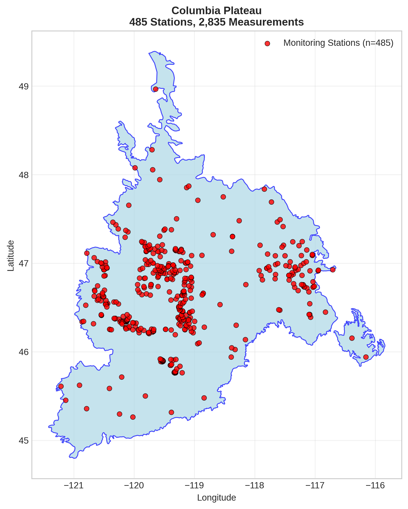
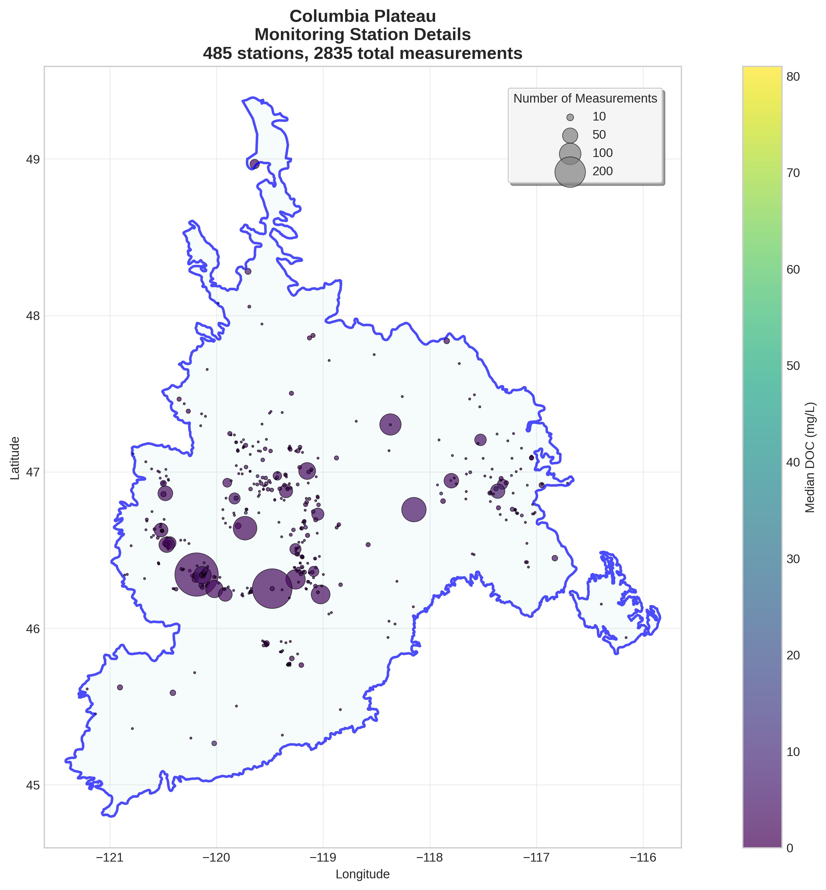
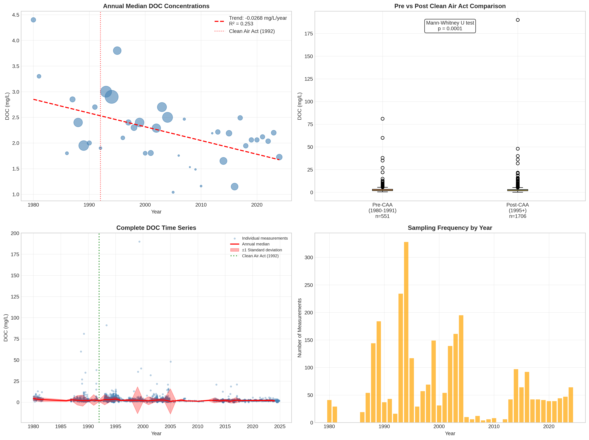

# Columbia Plateau - Detailed DOC Analysis

## Overview
- **Total Measurements**: 2,835
- **Monitoring Stations**: 485
- **Temporal Coverage**: 1980-2024
- **Median DOC**: 2.35 mg/L
- **Mean DOC**: 3.01 ± 5.06 mg/L

## Spatial Distribution

*Figure 1: Columbia Plateau monitoring stations colored by decade. The blue boundary shows the ecoregion extent with surrounding context.*

## Station Details

*Figure 2: Individual monitoring stations within Columbia Plateau. Marker size indicates number of measurements, color indicates median DOC concentration.*

## Temporal Analysis

*Figure 3: Comprehensive temporal analysis including annual trends, Clean Air Act comparison, seasonal patterns, and data coverage.*

## Statistical Summary

### DOC Distribution
- **Median**: 2.35 mg/L
- **25th Percentile**: 1.69 mg/L  
- **75th Percentile**: 3.30 mg/L
- **Standard Deviation**: 5.06 mg/L

### Clean Air Act Impact Analysis

- **Pre-CAA (1980-1991)**: 2.40 mg/L (n=551)
- **Post-CAA (1995+)**: 2.20 mg/L (n=1706)
- **Change**: -8.3%
- **Statistical Test**: **Statistically significant** (p = 0.0001)

### Long-term Trend Analysis

- **Trend**: decreasing at -0.0268 mg/L per year
- **R² Value**: 0.253
- **Statistical Significance**: **Statistically significant** (p = 0.0009)

---
*Generated on: 2025-08-14 09:53:54*
*Analysis period: 1980-2024*
