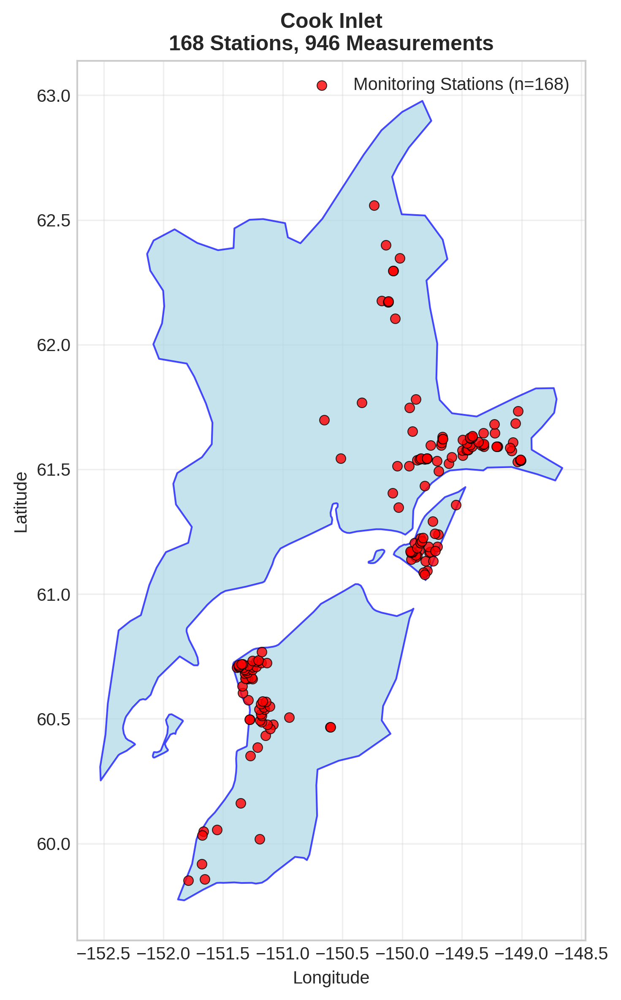
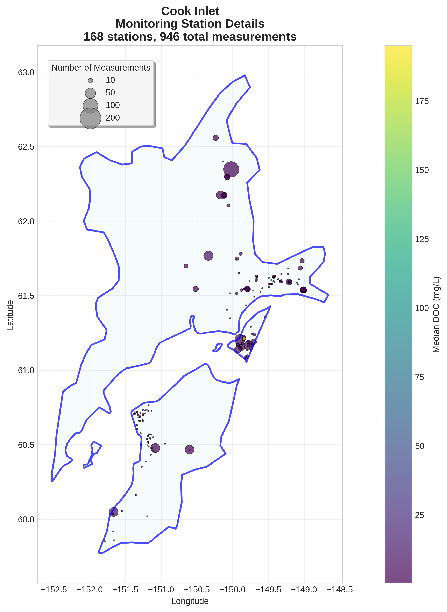
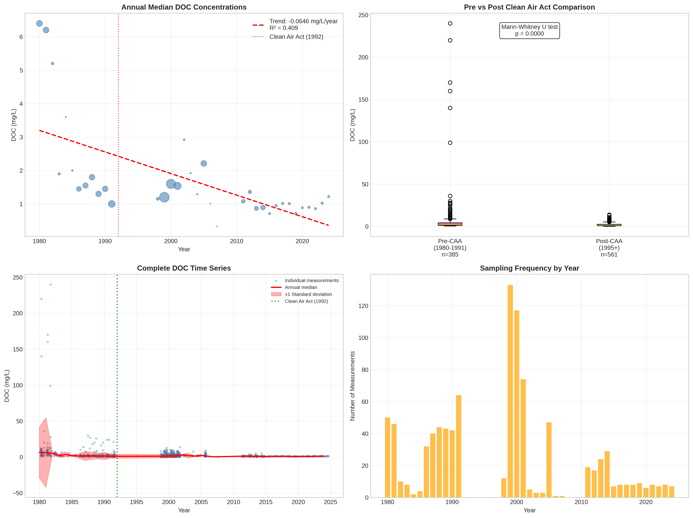

# Cook Inlet - Detailed DOC Analysis

## Overview
- **Total Measurements**: 946
- **Monitoring Stations**: 168
- **Temporal Coverage**: 1980-2024
- **Median DOC**: 1.40 mg/L
- **Mean DOC**: 3.83 ± 14.40 mg/L

## Spatial Distribution

*Figure 1: Cook Inlet monitoring stations colored by decade. The blue boundary shows the ecoregion extent with surrounding context.*

## Station Details

*Figure 2: Individual monitoring stations within Cook Inlet. Marker size indicates number of measurements, color indicates median DOC concentration.*

## Temporal Analysis

*Figure 3: Comprehensive temporal analysis including annual trends, Clean Air Act comparison, seasonal patterns, and data coverage.*

## Statistical Summary

### DOC Distribution
- **Median**: 1.40 mg/L
- **25th Percentile**: 0.80 mg/L  
- **75th Percentile**: 3.19 mg/L
- **Standard Deviation**: 14.40 mg/L

### Clean Air Act Impact Analysis

- **Pre-CAA (1980-1991)**: 1.80 mg/L (n=385)
- **Post-CAA (1995+)**: 1.14 mg/L (n=561)
- **Change**: -36.7%
- **Statistical Test**: **Statistically significant** (p = 0.0000)

### Long-term Trend Analysis

- **Trend**: decreasing at -0.0646 mg/L per year
- **R² Value**: 0.409
- **Statistical Significance**: **Statistically significant** (p = 0.0000)

---
*Generated on: 2025-08-14 09:54:30*
*Analysis period: 1980-2024*
