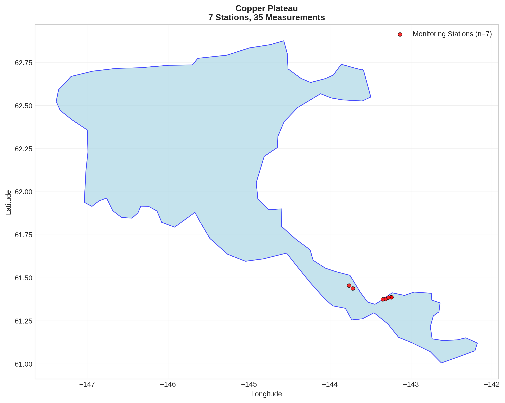
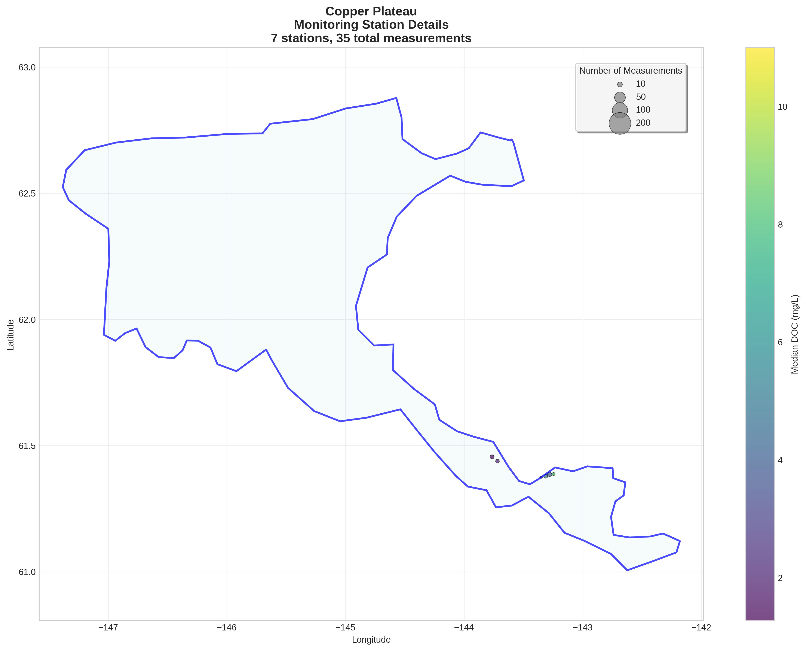
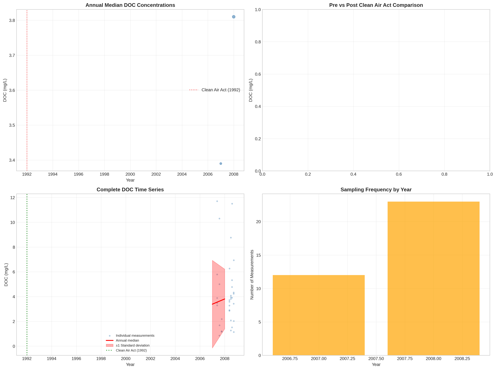

# Copper Plateau - Detailed DOC Analysis

## Overview
- **Total Measurements**: 35
- **Monitoring Stations**: 7
- **Temporal Coverage**: 2007-2008
- **Median DOC**: 3.72 mg/L
- **Mean DOC**: 4.18 ± 2.79 mg/L

## Spatial Distribution

*Figure 1: Copper Plateau monitoring stations colored by decade. The blue boundary shows the ecoregion extent with surrounding context.*

## Station Details

*Figure 2: Individual monitoring stations within Copper Plateau. Marker size indicates number of measurements, color indicates median DOC concentration.*

## Temporal Analysis

*Figure 3: Comprehensive temporal analysis including annual trends, Clean Air Act comparison, seasonal patterns, and data coverage.*

## Statistical Summary

### DOC Distribution
- **Median**: 3.72 mg/L
- **25th Percentile**: 2.13 mg/L  
- **75th Percentile**: 4.89 mg/L
- **Standard Deviation**: 2.79 mg/L

### Long-term Trend Analysis

- **Trend**: decreasing at nan mg/L per year
- **R² Value**: nan
- **Statistical Significance**: Not statistically significant (p = nan)

---
*Generated on: 2025-08-14 09:55:24*
*Analysis period: 1980-2008*
