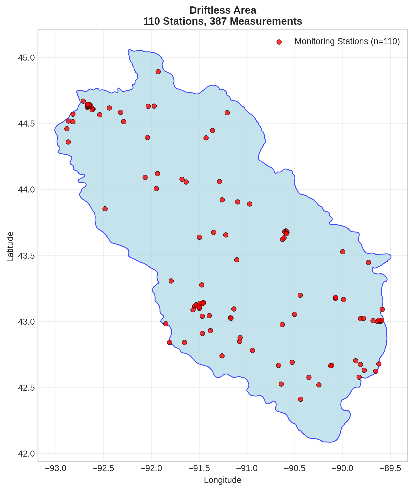

# Driftless Area - Detailed DOC Analysis

## Overview
- **Total Measurements**: 387
- **Monitoring Stations**: 110
- **Temporal Coverage**: 1980-2019
- **Median DOC**: 2.18 mg/L
- **Mean DOC**: 3.52 ± 3.26 mg/L

## Spatial Distribution

*Figure 1: Driftless Area monitoring stations colored by decade. The blue boundary shows the ecoregion extent with surrounding context.*

## Station Details

*Figure 2: Individual monitoring stations within Driftless Area. Marker size indicates number of measurements, color indicates median DOC concentration.*

## Temporal Analysis

*Figure 3: Comprehensive temporal analysis including annual trends, Clean Air Act comparison, seasonal patterns, and data coverage.*

## Statistical Summary

### DOC Distribution
- **Median**: 2.18 mg/L
- **25th Percentile**: 1.20 mg/L  
- **75th Percentile**: 5.42 mg/L
- **Standard Deviation**: 3.26 mg/L

### Clean Air Act Impact Analysis

- **Pre-CAA (1980-1991)**: 2.70 mg/L (n=100)
- **Post-CAA (1995+)**: 2.17 mg/L (n=280)
- **Change**: -19.8%
- **Statistical Test**: Not statistically significant (p = 0.5701)

### Long-term Trend Analysis

- **Trend**: decreasing at -0.0908 mg/L per year
- **R² Value**: 0.176
- **Statistical Significance**: **Statistically significant** (p = 0.0208)

---
*Generated on: 2025-08-14 09:54:53*
*Analysis period: 1980-2019*
