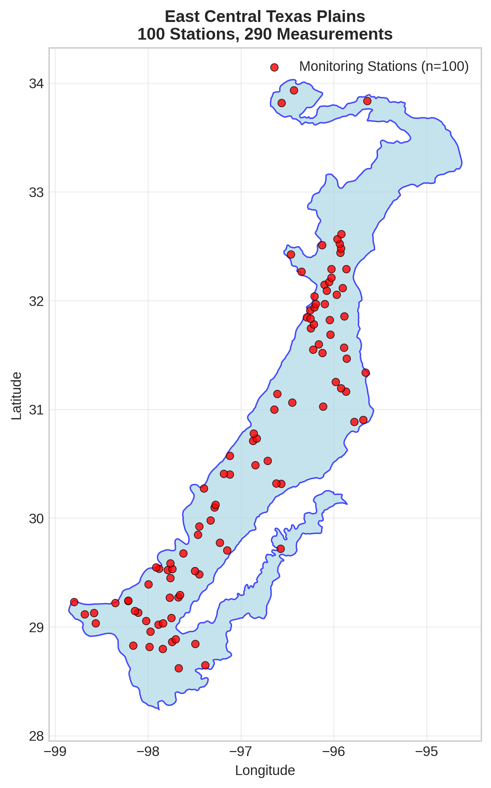
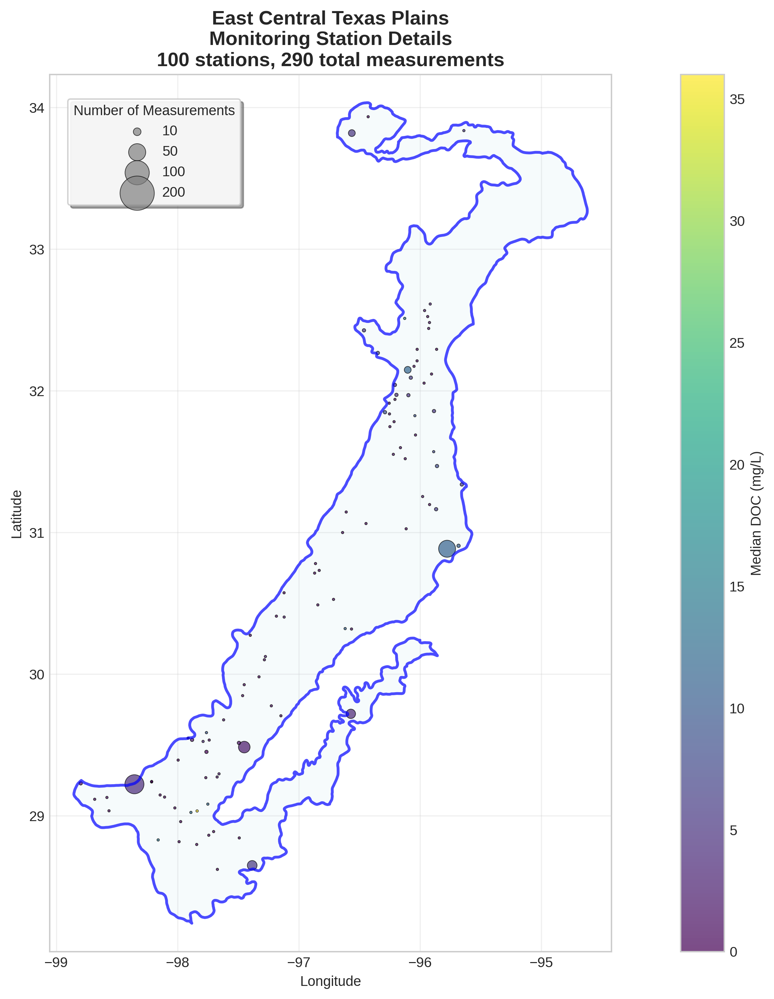
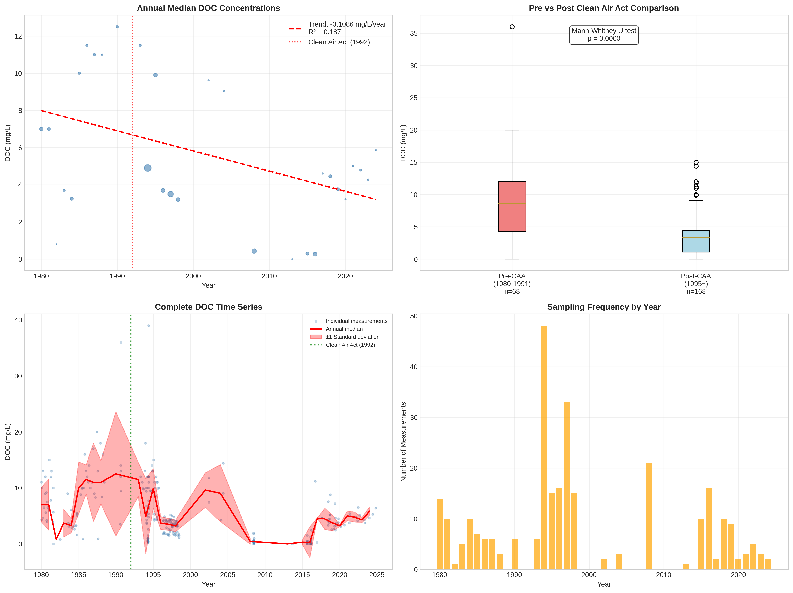

# East Central Texas Plains - Detailed DOC Analysis

## Overview
- **Total Measurements**: 290
- **Monitoring Stations**: 100
- **Temporal Coverage**: 1980-2024
- **Median DOC**: 4.06 mg/L
- **Mean DOC**: 5.24 ± 5.09 mg/L

## Spatial Distribution

*Figure 1: East Central Texas Plains monitoring stations colored by decade. The blue boundary shows the ecoregion extent with surrounding context.*

## Station Details

*Figure 2: Individual monitoring stations within East Central Texas Plains. Marker size indicates number of measurements, color indicates median DOC concentration.*

## Temporal Analysis

*Figure 3: Comprehensive temporal analysis including annual trends, Clean Air Act comparison, seasonal patterns, and data coverage.*

## Statistical Summary

### DOC Distribution
- **Median**: 4.06 mg/L
- **25th Percentile**: 1.60 mg/L  
- **75th Percentile**: 7.78 mg/L
- **Standard Deviation**: 5.09 mg/L

### Clean Air Act Impact Analysis

- **Pre-CAA (1980-1991)**: 8.60 mg/L (n=68)
- **Post-CAA (1995+)**: 3.30 mg/L (n=168)
- **Change**: -61.6%
- **Statistical Test**: **Statistically significant** (p = 0.0000)

### Long-term Trend Analysis

- **Trend**: decreasing at -0.1086 mg/L per year
- **R² Value**: 0.187
- **Statistical Significance**: **Statistically significant** (p = 0.0169)

---
*Generated on: 2025-08-14 09:55:02*
*Analysis period: 1980-2024*
