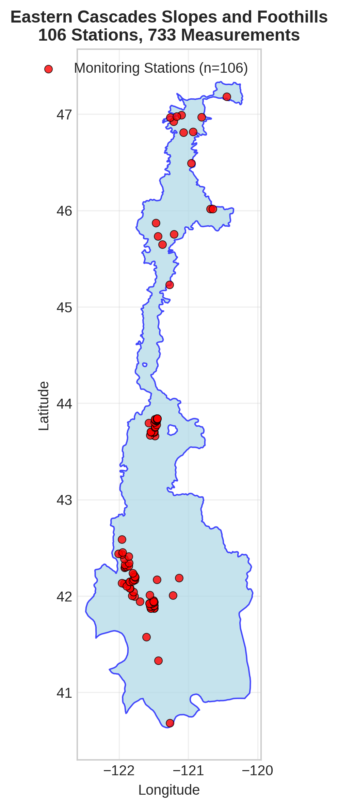
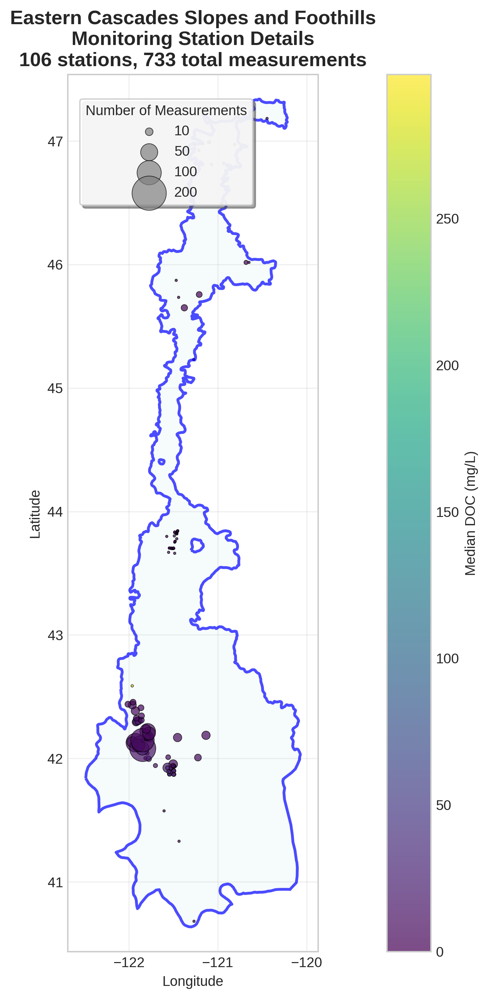
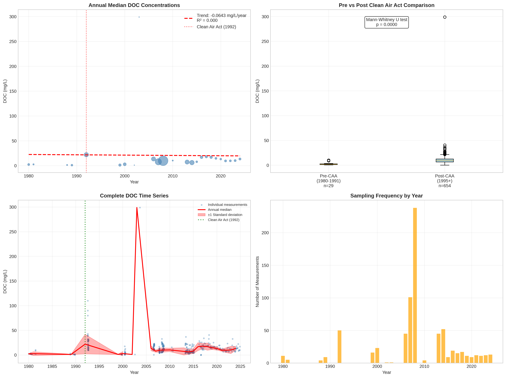

# Eastern Cascades Slopes and Foothills - Detailed DOC Analysis

## Overview
- **Total Measurements**: 733
- **Monitoring Stations**: 106
- **Temporal Coverage**: 1980-2024
- **Median DOC**: 9.80 mg/L
- **Mean DOC**: 11.54 ± 13.75 mg/L

## Spatial Distribution

*Figure 1: Eastern Cascades Slopes and Foothills monitoring stations colored by decade. The blue boundary shows the ecoregion extent with surrounding context.*

## Station Details

*Figure 2: Individual monitoring stations within Eastern Cascades Slopes and Foothills. Marker size indicates number of measurements, color indicates median DOC concentration.*

## Temporal Analysis

*Figure 3: Comprehensive temporal analysis including annual trends, Clean Air Act comparison, seasonal patterns, and data coverage.*

## Statistical Summary

### DOC Distribution
- **Median**: 9.80 mg/L
- **25th Percentile**: 6.40 mg/L  
- **75th Percentile**: 13.20 mg/L
- **Standard Deviation**: 13.75 mg/L

### Clean Air Act Impact Analysis

- **Pre-CAA (1980-1991)**: 1.70 mg/L (n=29)
- **Post-CAA (1995+)**: 9.61 mg/L (n=654)
- **Change**: 465.3%
- **Statistical Test**: **Statistically significant** (p = 0.0000)

### Long-term Trend Analysis

- **Trend**: decreasing at -0.0643 mg/L per year
- **R² Value**: 0.000
- **Statistical Significance**: Not statistically significant (p = 0.9448)

---
*Generated on: 2025-08-14 09:54:38*
*Analysis period: 1980-2024*
