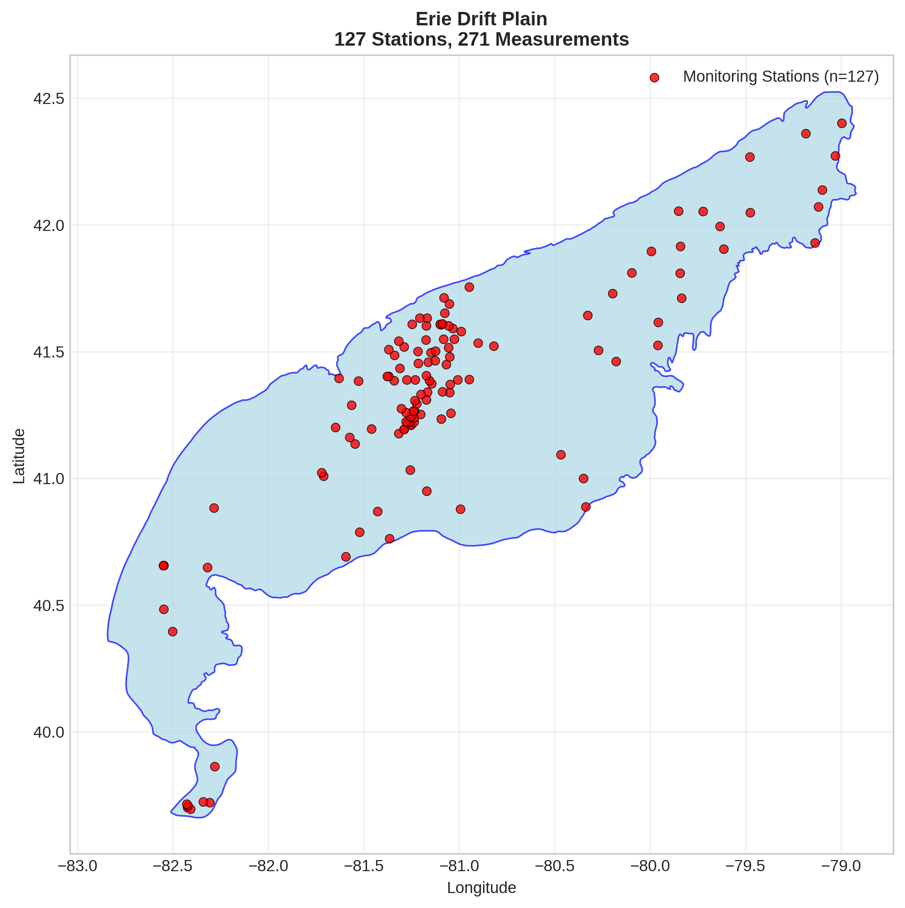
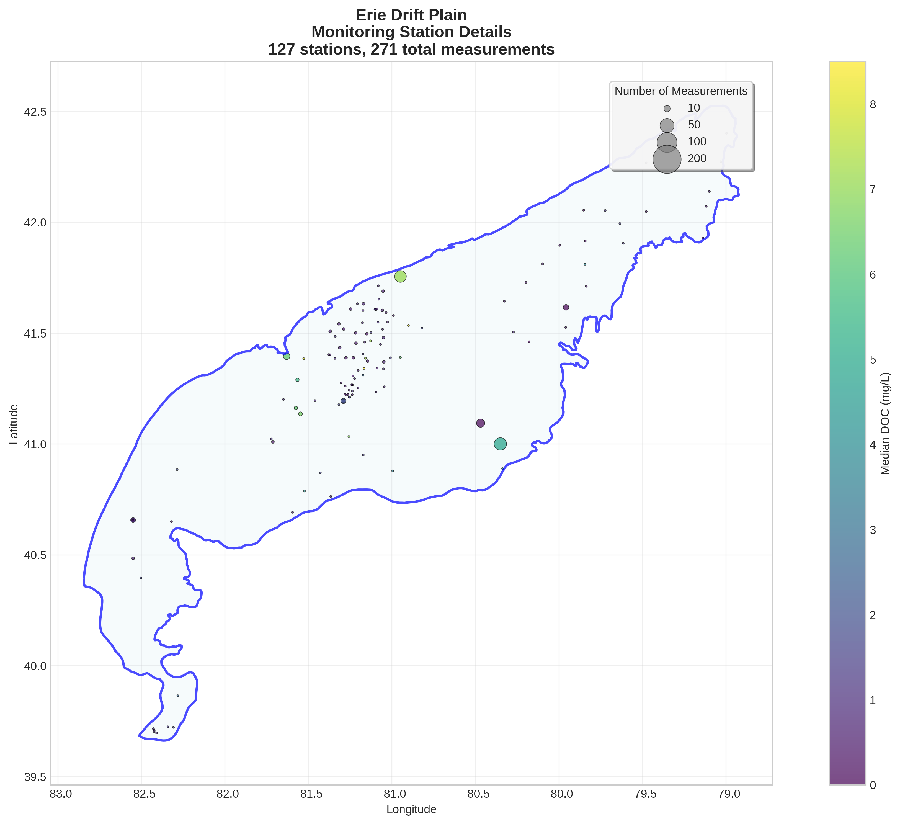
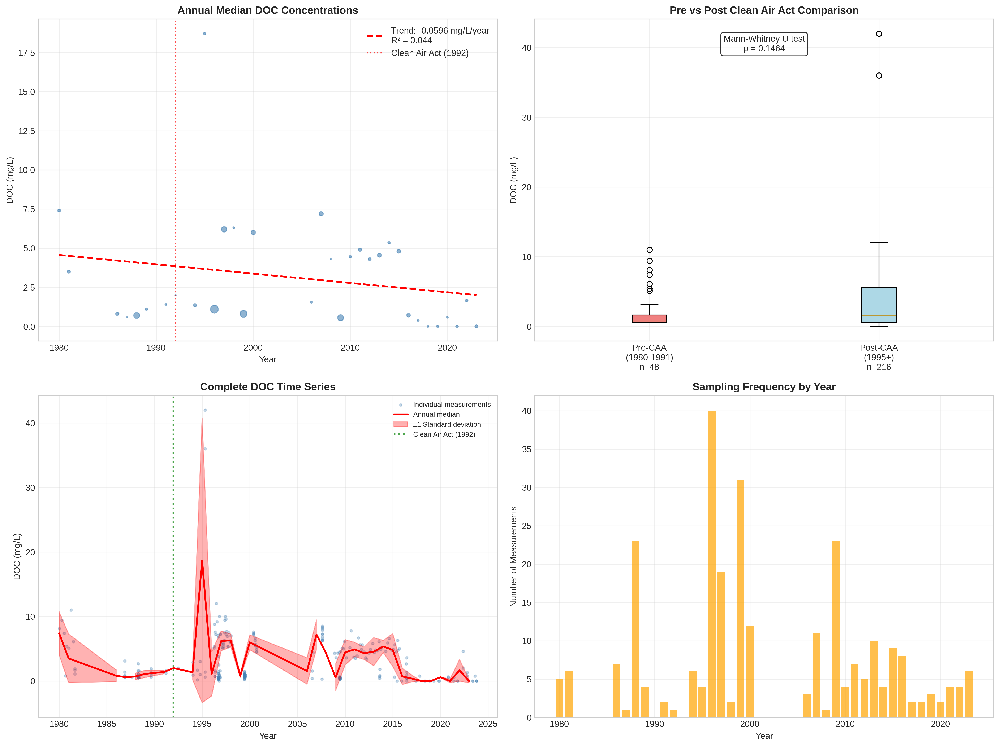

# Erie Drift Plain - Detailed DOC Analysis

## Overview
- **Total Measurements**: 271
- **Monitoring Stations**: 127
- **Temporal Coverage**: 1980-2023
- **Median DOC**: 1.30 mg/L
- **Mean DOC**: 3.15 ± 4.21 mg/L

## Spatial Distribution

*Figure 1: Erie Drift Plain monitoring stations colored by decade. The blue boundary shows the ecoregion extent with surrounding context.*

## Station Details

*Figure 2: Individual monitoring stations within Erie Drift Plain. Marker size indicates number of measurements, color indicates median DOC concentration.*

## Temporal Analysis

*Figure 3: Comprehensive temporal analysis including annual trends, Clean Air Act comparison, seasonal patterns, and data coverage.*

## Statistical Summary

### DOC Distribution
- **Median**: 1.30 mg/L
- **25th Percentile**: 0.60 mg/L  
- **75th Percentile**: 5.25 mg/L
- **Standard Deviation**: 4.21 mg/L

### Clean Air Act Impact Analysis

- **Pre-CAA (1980-1991)**: 0.80 mg/L (n=48)
- **Post-CAA (1995+)**: 1.52 mg/L (n=216)
- **Change**: 90.6%
- **Statistical Test**: Not statistically significant (p = 0.1464)

### Long-term Trend Analysis

- **Trend**: decreasing at -0.0596 mg/L per year
- **R² Value**: 0.044
- **Statistical Significance**: Not statistically significant (p = 0.2413)

---
*Generated on: 2025-08-14 09:55:04*
*Analysis period: 1980-2023*
