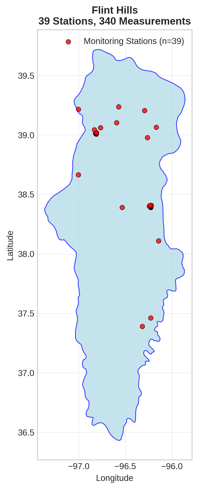
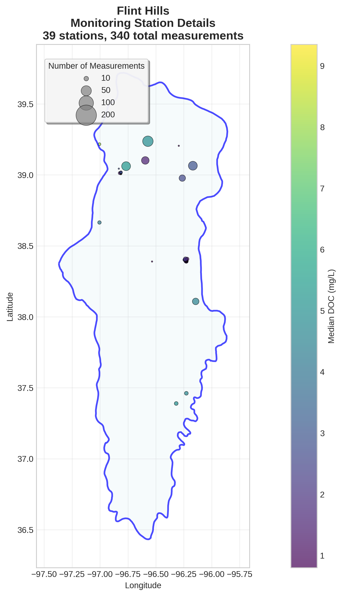
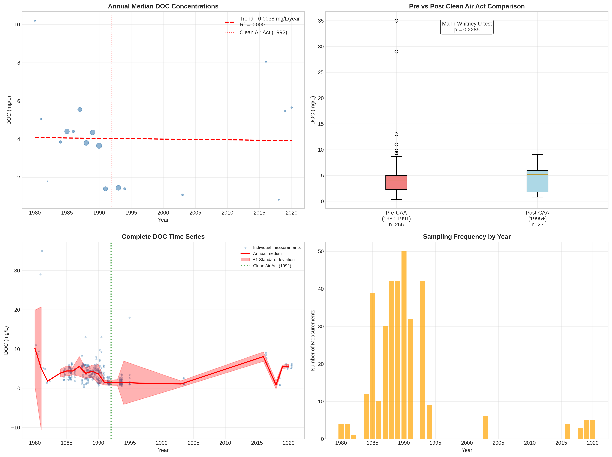

# Flint Hills - Detailed DOC Analysis

## Overview
- **Total Measurements**: 340
- **Monitoring Stations**: 39
- **Temporal Coverage**: 1980-2020
- **Median DOC**: 3.40 mg/L
- **Mean DOC**: 3.74 ± 3.10 mg/L

## Spatial Distribution

*Figure 1: Flint Hills monitoring stations colored by decade. The blue boundary shows the ecoregion extent with surrounding context.*

## Station Details

*Figure 2: Individual monitoring stations within Flint Hills. Marker size indicates number of measurements, color indicates median DOC concentration.*

## Temporal Analysis

*Figure 3: Comprehensive temporal analysis including annual trends, Clean Air Act comparison, seasonal patterns, and data coverage.*

## Statistical Summary

### DOC Distribution
- **Median**: 3.40 mg/L
- **25th Percentile**: 1.80 mg/L  
- **75th Percentile**: 4.90 mg/L
- **Standard Deviation**: 3.10 mg/L

### Clean Air Act Impact Analysis

- **Pre-CAA (1980-1991)**: 3.95 mg/L (n=266)
- **Post-CAA (1995+)**: 5.20 mg/L (n=23)
- **Change**: 31.6%
- **Statistical Test**: Not statistically significant (p = 0.2285)

### Long-term Trend Analysis

- **Trend**: decreasing at -0.0038 mg/L per year
- **R² Value**: 0.000
- **Statistical Significance**: Not statistically significant (p = 0.9329)

---
*Generated on: 2025-08-14 09:54:56*
*Analysis period: 1980-2020*
