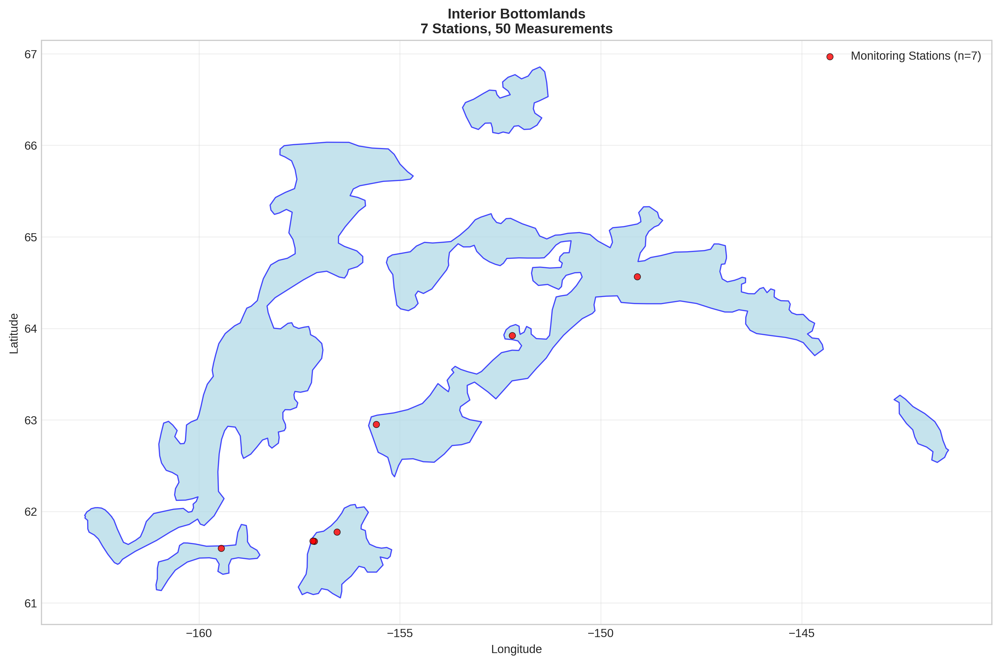
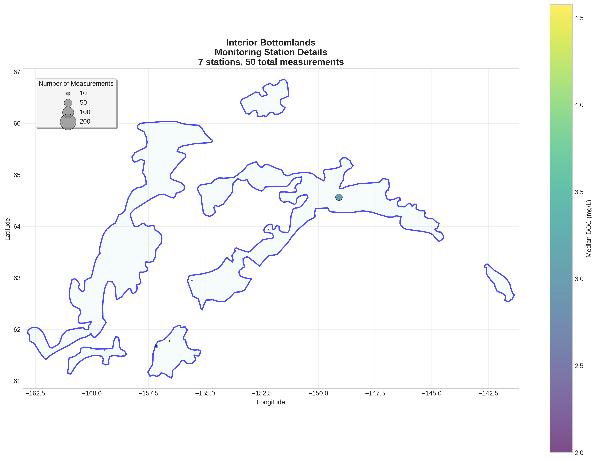
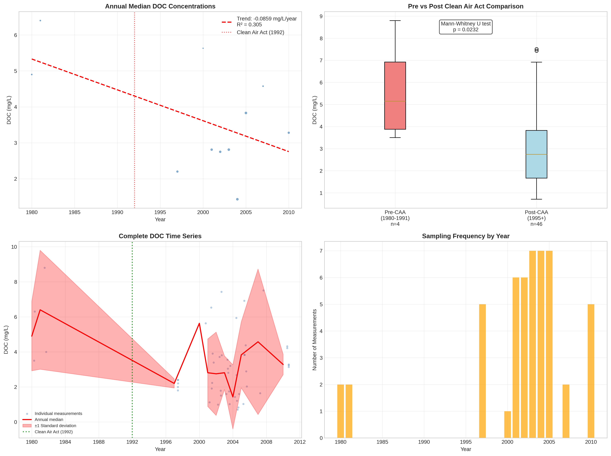

# Interior Bottomlands - Detailed DOC Analysis

## Overview
- **Total Measurements**: 50
- **Monitoring Stations**: 7
- **Temporal Coverage**: 1980-2010
- **Median DOC**: 2.96 mg/L
- **Mean DOC**: 3.22 ± 1.94 mg/L

## Spatial Distribution

*Figure 1: Interior Bottomlands monitoring stations colored by decade. The blue boundary shows the ecoregion extent with surrounding context.*

## Station Details

*Figure 2: Individual monitoring stations within Interior Bottomlands. Marker size indicates number of measurements, color indicates median DOC concentration.*

## Temporal Analysis

*Figure 3: Comprehensive temporal analysis including annual trends, Clean Air Act comparison, seasonal patterns, and data coverage.*

## Statistical Summary

### DOC Distribution
- **Median**: 2.96 mg/L
- **25th Percentile**: 1.75 mg/L  
- **75th Percentile**: 3.88 mg/L
- **Standard Deviation**: 1.94 mg/L

### Long-term Trend Analysis

- **Trend**: decreasing at -0.0859 mg/L per year
- **R² Value**: 0.305
- **Statistical Significance**: Not statistically significant (p = 0.0780)

---
*Generated on: 2025-08-14 09:55:18*
*Analysis period: 1980-2010*
