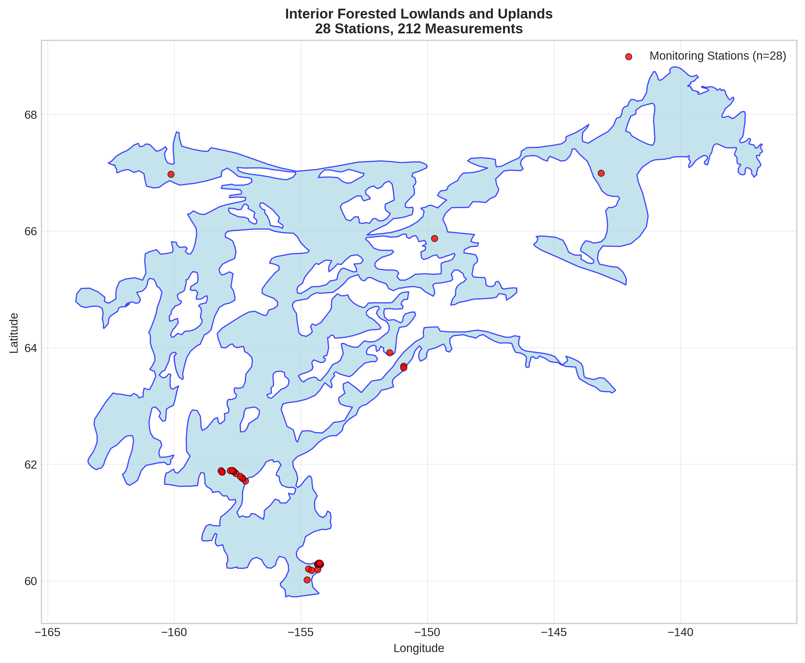
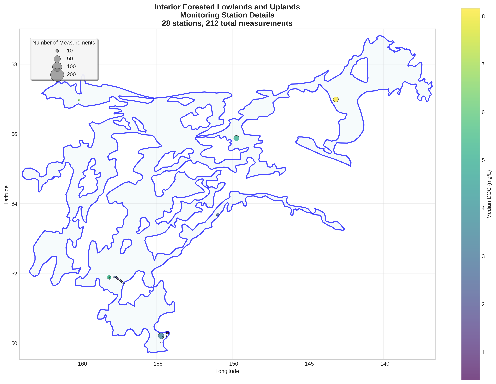
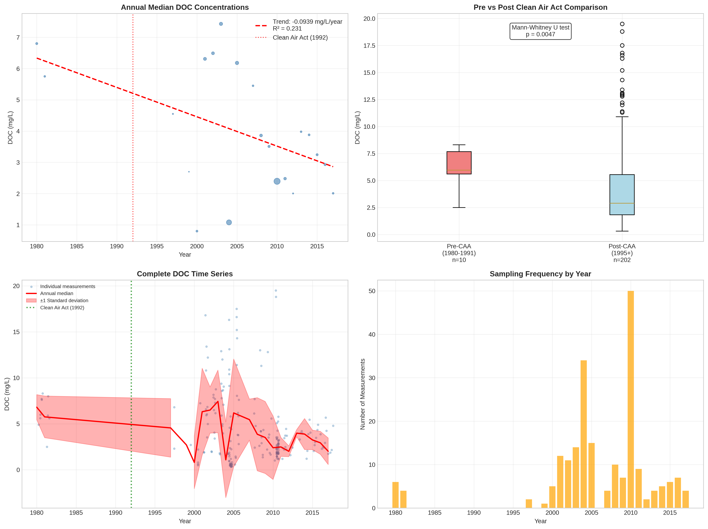

# Interior Forested Lowlands and Uplands - Detailed DOC Analysis

## Overview
- **Total Measurements**: 212
- **Monitoring Stations**: 28
- **Temporal Coverage**: 1980-2017
- **Median DOC**: 3.06 mg/L
- **Mean DOC**: 4.40 ± 3.85 mg/L

## Spatial Distribution

*Figure 1: Interior Forested Lowlands and Uplands monitoring stations colored by decade. The blue boundary shows the ecoregion extent with surrounding context.*

## Station Details

*Figure 2: Individual monitoring stations within Interior Forested Lowlands and Uplands. Marker size indicates number of measurements, color indicates median DOC concentration.*

## Temporal Analysis

*Figure 3: Comprehensive temporal analysis including annual trends, Clean Air Act comparison, seasonal patterns, and data coverage.*

## Statistical Summary

### DOC Distribution
- **Median**: 3.06 mg/L
- **25th Percentile**: 1.85 mg/L  
- **75th Percentile**: 5.81 mg/L
- **Standard Deviation**: 3.85 mg/L

### Clean Air Act Impact Analysis

- **Pre-CAA (1980-1991)**: 5.95 mg/L (n=10)
- **Post-CAA (1995+)**: 2.89 mg/L (n=202)
- **Change**: -51.4%
- **Statistical Test**: **Statistically significant** (p = 0.0047)

### Long-term Trend Analysis

- **Trend**: decreasing at -0.0939 mg/L per year
- **R² Value**: 0.231
- **Statistical Significance**: **Statistically significant** (p = 0.0275)

---
*Generated on: 2025-08-14 09:55:07*
*Analysis period: 1980-2017*
