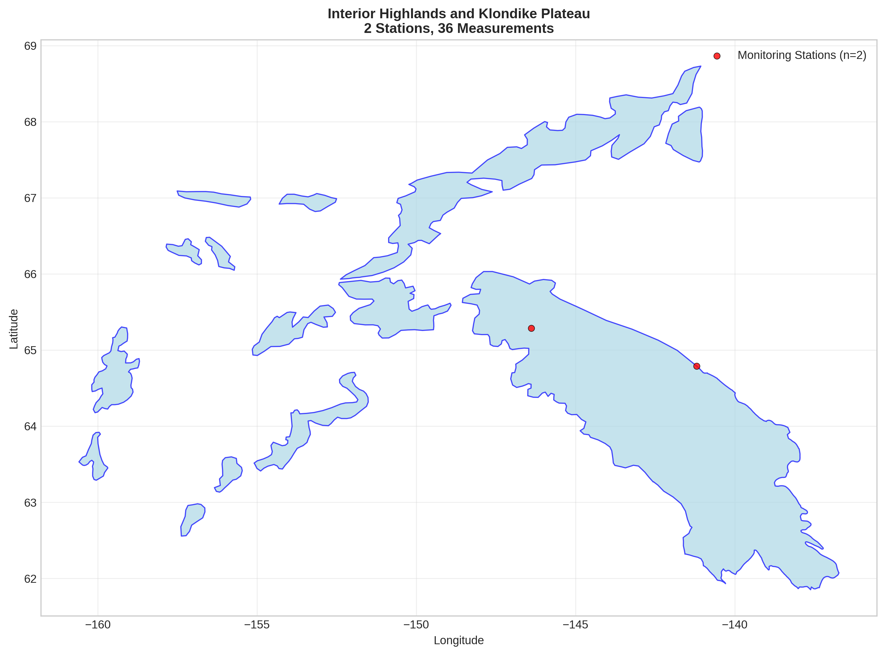
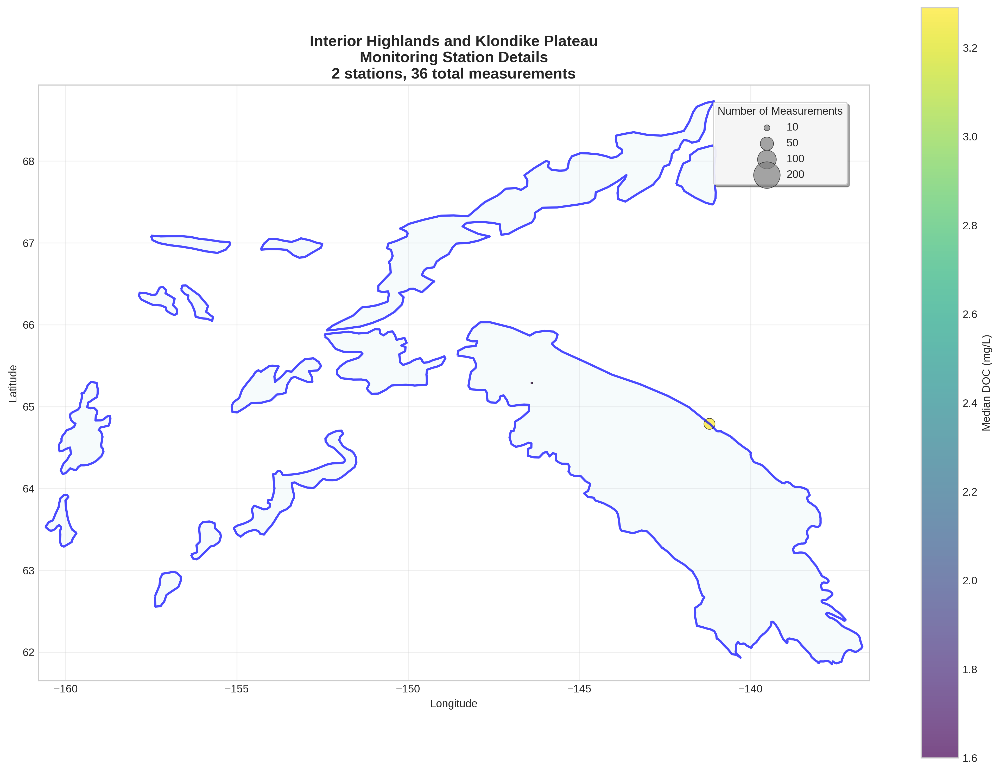
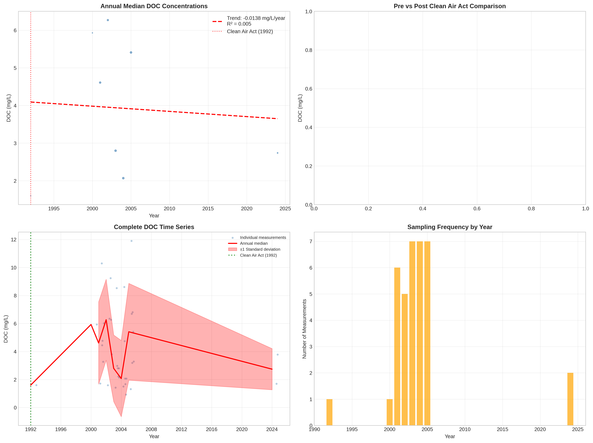

# Interior Highlands and Klondike Plateau - Detailed DOC Analysis

## Overview
- **Total Measurements**: 36
- **Monitoring Stations**: 2
- **Temporal Coverage**: 1992-2024
- **Median DOC**: 3.28 mg/L
- **Mean DOC**: 4.27 ± 2.84 mg/L

## Spatial Distribution

*Figure 1: Interior Highlands and Klondike Plateau monitoring stations colored by decade. The blue boundary shows the ecoregion extent with surrounding context.*

## Station Details

*Figure 2: Individual monitoring stations within Interior Highlands and Klondike Plateau. Marker size indicates number of measurements, color indicates median DOC concentration.*

## Temporal Analysis

*Figure 3: Comprehensive temporal analysis including annual trends, Clean Air Act comparison, seasonal patterns, and data coverage.*

## Statistical Summary

### DOC Distribution
- **Median**: 3.28 mg/L
- **25th Percentile**: 1.98 mg/L  
- **75th Percentile**: 6.08 mg/L
- **Standard Deviation**: 2.84 mg/L

### Long-term Trend Analysis

- **Trend**: decreasing at -0.0138 mg/L per year
- **R² Value**: 0.005
- **Statistical Significance**: Not statistically significant (p = 0.8727)

---
*Generated on: 2025-08-14 09:55:22*
*Analysis period: 1980-2024*
