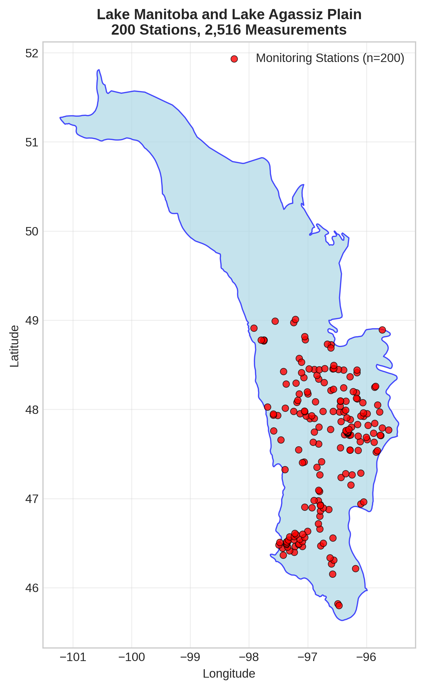
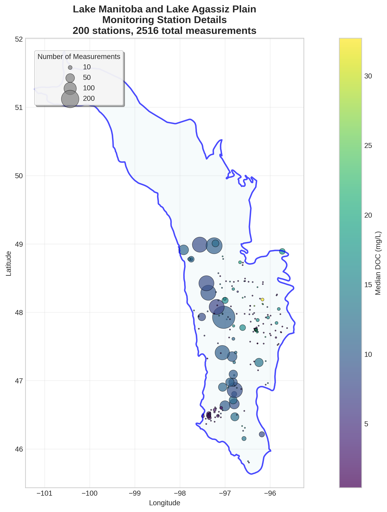
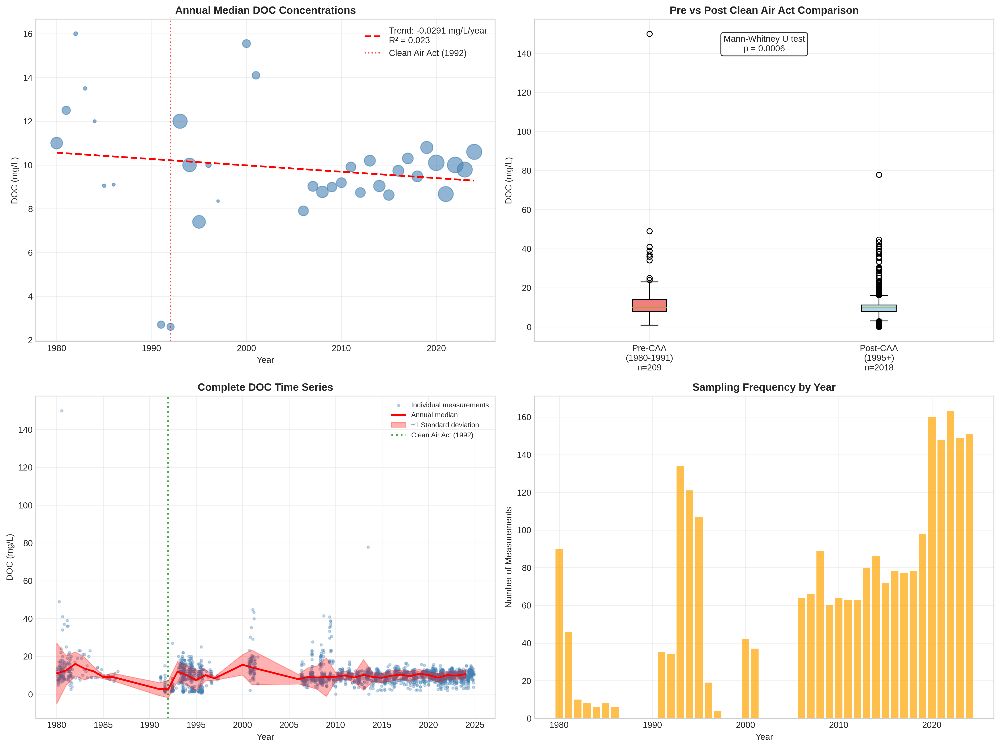

# Lake Manitoba and Lake Agassiz Plain - Detailed DOC Analysis

## Overview
- **Total Measurements**: 2,516
- **Monitoring Stations**: 200
- **Temporal Coverage**: 1980-2024
- **Median DOC**: 9.70 mg/L
- **Mean DOC**: 10.03 ± 5.54 mg/L

## Spatial Distribution

*Figure 1: Lake Manitoba and Lake Agassiz Plain monitoring stations colored by decade. The blue boundary shows the ecoregion extent with surrounding context.*

## Station Details

*Figure 2: Individual monitoring stations within Lake Manitoba and Lake Agassiz Plain. Marker size indicates number of measurements, color indicates median DOC concentration.*

## Temporal Analysis

*Figure 3: Comprehensive temporal analysis including annual trends, Clean Air Act comparison, seasonal patterns, and data coverage.*

## Statistical Summary

### DOC Distribution
- **Median**: 9.70 mg/L
- **25th Percentile**: 7.80 mg/L  
- **75th Percentile**: 11.60 mg/L
- **Standard Deviation**: 5.54 mg/L

### Clean Air Act Impact Analysis

- **Pre-CAA (1980-1991)**: 10.00 mg/L (n=209)
- **Post-CAA (1995+)**: 9.68 mg/L (n=2018)
- **Change**: -3.2%
- **Statistical Test**: **Statistically significant** (p = 0.0006)

### Long-term Trend Analysis

- **Trend**: decreasing at -0.0291 mg/L per year
- **R² Value**: 0.023
- **Statistical Significance**: Not statistically significant (p = 0.3835)

---
*Generated on: 2025-08-14 09:53:58*
*Analysis period: 1980-2024*
