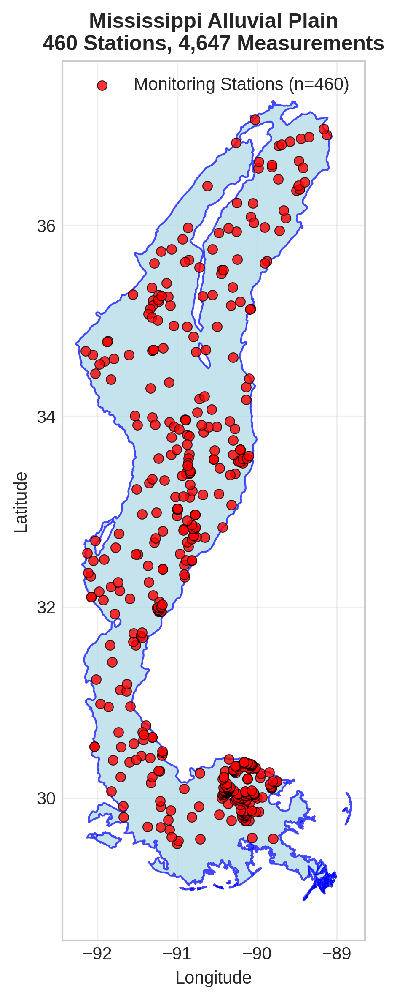

# Mississippi Alluvial Plain - Detailed DOC Analysis

## Overview
- **Total Measurements**: 4,647
- **Monitoring Stations**: 460
- **Temporal Coverage**: 1980-2024
- **Median DOC**: 4.38 mg/L
- **Mean DOC**: 5.07 ± 3.15 mg/L

## Spatial Distribution

*Figure 1: Mississippi Alluvial Plain monitoring stations colored by decade. The blue boundary shows the ecoregion extent with surrounding context.*

## Station Details

*Figure 2: Individual monitoring stations within Mississippi Alluvial Plain. Marker size indicates number of measurements, color indicates median DOC concentration.*

## Temporal Analysis

*Figure 3: Comprehensive temporal analysis including annual trends, Clean Air Act comparison, seasonal patterns, and data coverage.*

## Statistical Summary

### DOC Distribution
- **Median**: 4.38 mg/L
- **25th Percentile**: 3.63 mg/L  
- **75th Percentile**: 5.70 mg/L
- **Standard Deviation**: 3.15 mg/L

### Clean Air Act Impact Analysis

- **Pre-CAA (1980-1991)**: 6.60 mg/L (n=603)
- **Post-CAA (1995+)**: 4.20 mg/L (n=3932)
- **Change**: -36.4%
- **Statistical Test**: **Statistically significant** (p = 0.0000)

### Long-term Trend Analysis

- **Trend**: decreasing at -0.0368 mg/L per year
- **R² Value**: 0.091
- **Statistical Significance**: **Statistically significant** (p = 0.0446)

---
*Generated on: 2025-08-14 09:53:35*
*Analysis period: 1980-2024*
