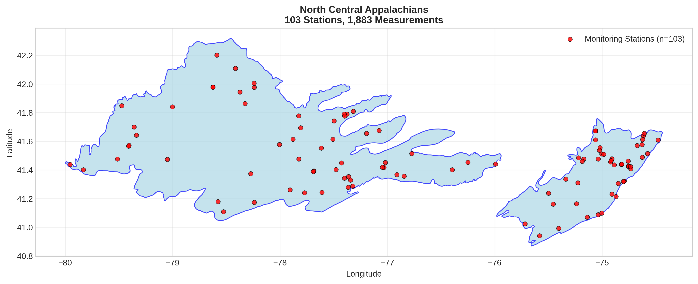
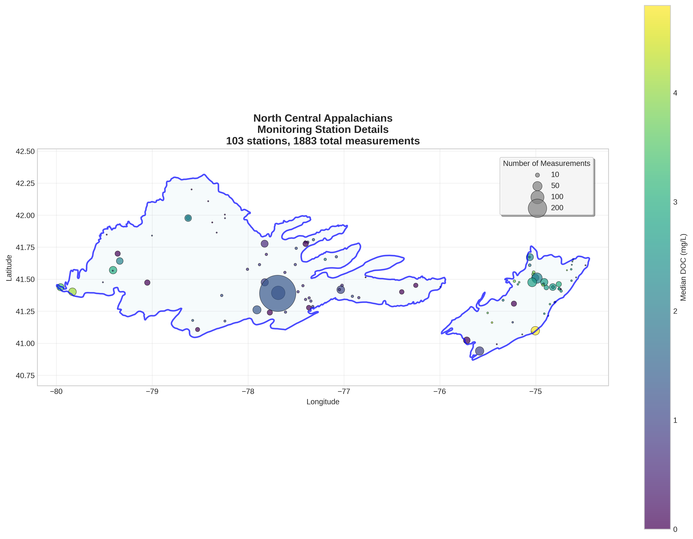
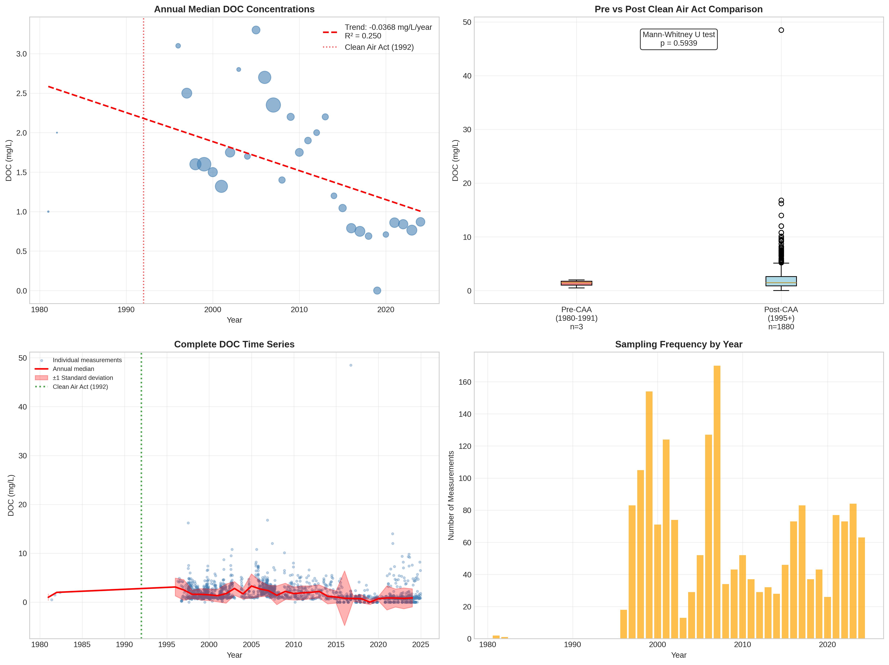

# North Central Appalachians - Detailed DOC Analysis

## Overview
- **Total Measurements**: 1,883
- **Monitoring Stations**: 103
- **Temporal Coverage**: 1981-2024
- **Median DOC**: 1.48 mg/L
- **Mean DOC**: 1.94 ± 1.97 mg/L

## Spatial Distribution

*Figure 1: North Central Appalachians monitoring stations colored by decade. The blue boundary shows the ecoregion extent with surrounding context.*

## Station Details

*Figure 2: Individual monitoring stations within North Central Appalachians. Marker size indicates number of measurements, color indicates median DOC concentration.*

## Temporal Analysis

*Figure 3: Comprehensive temporal analysis including annual trends, Clean Air Act comparison, seasonal patterns, and data coverage.*

## Statistical Summary

### DOC Distribution
- **Median**: 1.48 mg/L
- **25th Percentile**: 0.88 mg/L  
- **75th Percentile**: 2.60 mg/L
- **Standard Deviation**: 1.97 mg/L

### Long-term Trend Analysis

- **Trend**: decreasing at -0.0368 mg/L per year
- **R² Value**: 0.250
- **Statistical Significance**: **Statistically significant** (p = 0.0042)

---
*Generated on: 2025-08-14 09:54:07*
*Analysis period: 1980-2024*
