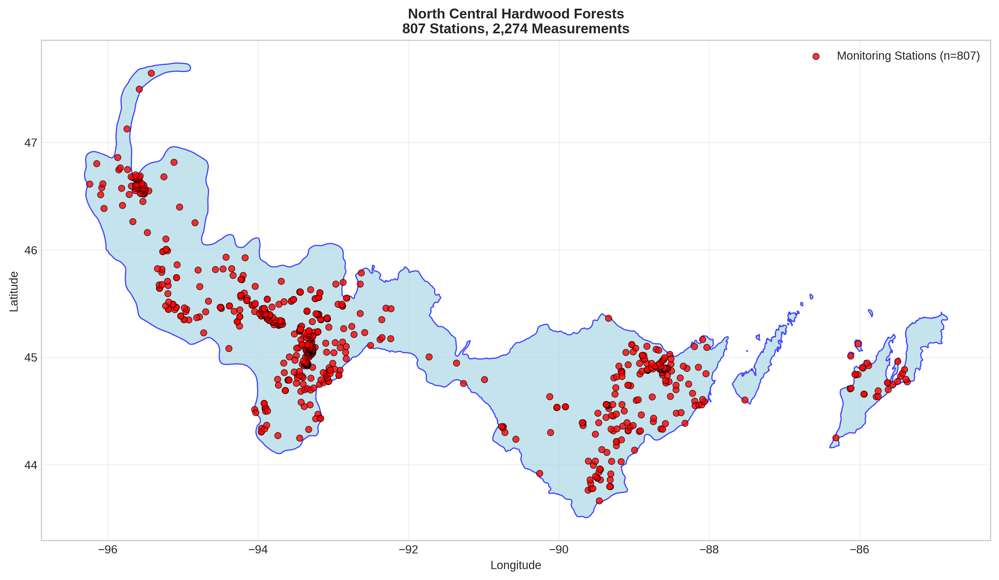
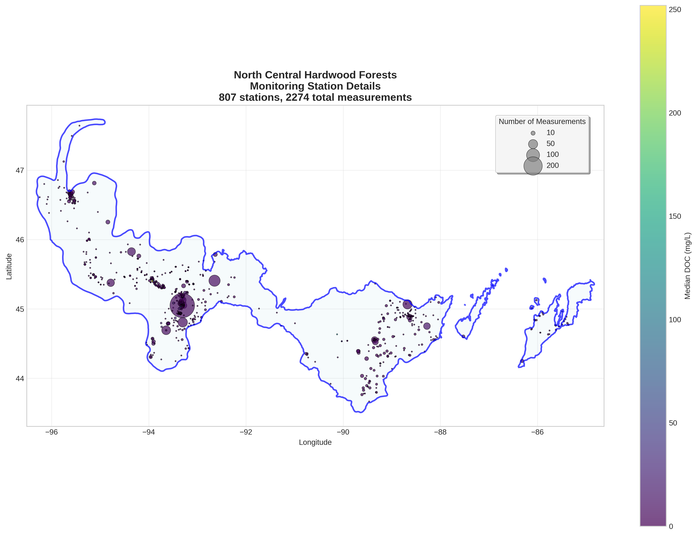
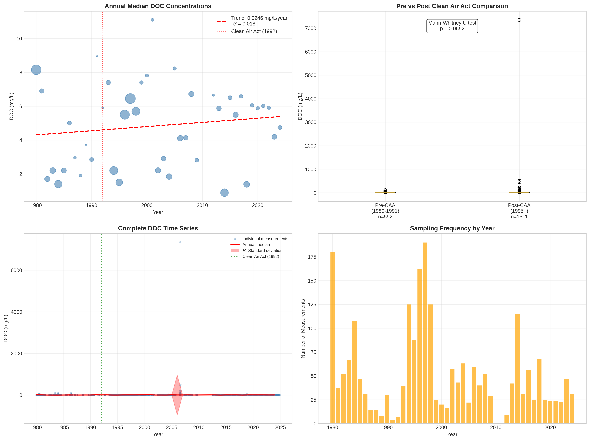

# North Central Hardwood Forests - Detailed DOC Analysis

## Overview
- **Total Measurements**: 2,274
- **Monitoring Stations**: 807
- **Temporal Coverage**: 1980-2024
- **Median DOC**: 4.60 mg/L
- **Mean DOC**: 9.59 ± 154.97 mg/L

## Spatial Distribution

*Figure 1: North Central Hardwood Forests monitoring stations colored by decade. The blue boundary shows the ecoregion extent with surrounding context.*

## Station Details

*Figure 2: Individual monitoring stations within North Central Hardwood Forests. Marker size indicates number of measurements, color indicates median DOC concentration.*

## Temporal Analysis

*Figure 3: Comprehensive temporal analysis including annual trends, Clean Air Act comparison, seasonal patterns, and data coverage.*

## Statistical Summary

### DOC Distribution
- **Median**: 4.60 mg/L
- **25th Percentile**: 1.60 mg/L  
- **75th Percentile**: 7.46 mg/L
- **Standard Deviation**: 154.97 mg/L

### Clean Air Act Impact Analysis

- **Pre-CAA (1980-1991)**: 2.95 mg/L (n=592)
- **Post-CAA (1995+)**: 5.30 mg/L (n=1511)
- **Change**: 79.7%
- **Statistical Test**: Not statistically significant (p = 0.0652)

### Long-term Trend Analysis

- **Trend**: increasing at 0.0246 mg/L per year
- **R² Value**: 0.018
- **Statistical Significance**: Not statistically significant (p = 0.3930)

---
*Generated on: 2025-08-14 09:54:04*
*Analysis period: 1980-2024*
