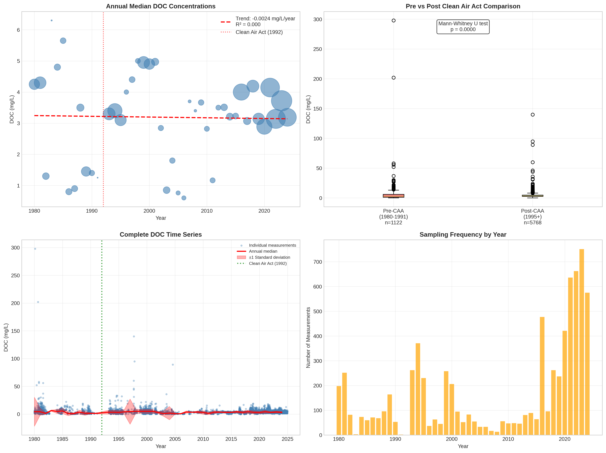

# Northeastern Coastal Zone - Detailed DOC Analysis

## Overview
- **Total Measurements**: 7,523
- **Monitoring Stations**: 1196
- **Temporal Coverage**: 1980-2024
- **Median DOC**: 3.42 mg/L
- **Mean DOC**: 4.12 ± 5.68 mg/L

## Spatial Distribution

*Figure 1: Northeastern Coastal Zone monitoring stations colored by decade. The blue boundary shows the ecoregion extent with surrounding context.*

## Station Details

*Figure 2: Individual monitoring stations within Northeastern Coastal Zone. Marker size indicates number of measurements, color indicates median DOC concentration.*

## Temporal Analysis

*Figure 3: Comprehensive temporal analysis including annual trends, Clean Air Act comparison, seasonal patterns, and data coverage.*

## Statistical Summary

### DOC Distribution
- **Median**: 3.42 mg/L
- **25th Percentile**: 2.34 mg/L  
- **75th Percentile**: 4.86 mg/L
- **Standard Deviation**: 5.68 mg/L

### Clean Air Act Impact Analysis

- **Pre-CAA (1980-1991)**: 2.70 mg/L (n=1122)
- **Post-CAA (1995+)**: 3.50 mg/L (n=5768)
- **Change**: 29.6%
- **Statistical Test**: **Statistically significant** (p = 0.0000)

### Long-term Trend Analysis

- **Trend**: decreasing at -0.0024 mg/L per year
- **R² Value**: 0.000
- **Statistical Significance**: Not statistically significant (p = 0.8889)

---
*Generated on: 2025-08-14 09:53:20*
*Analysis period: 1980-2024*
