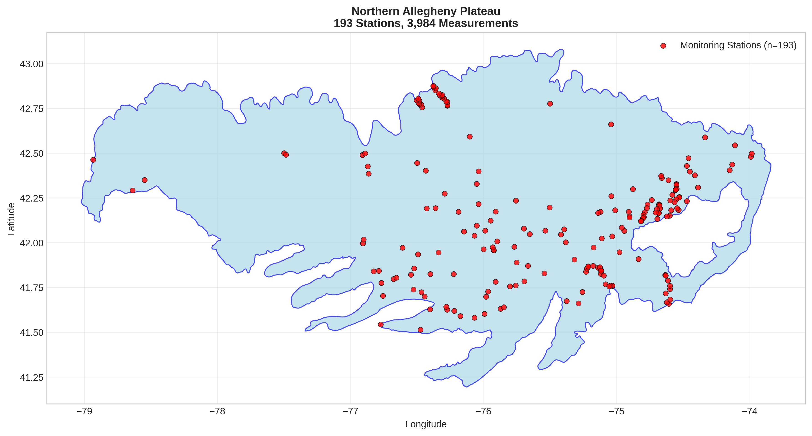
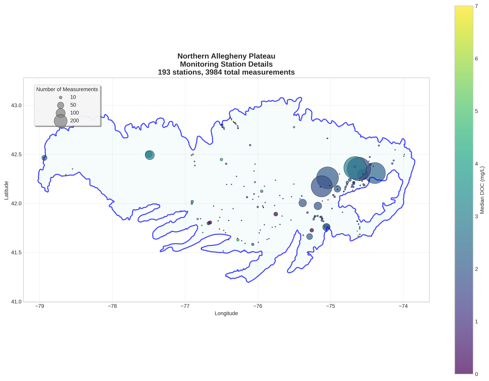
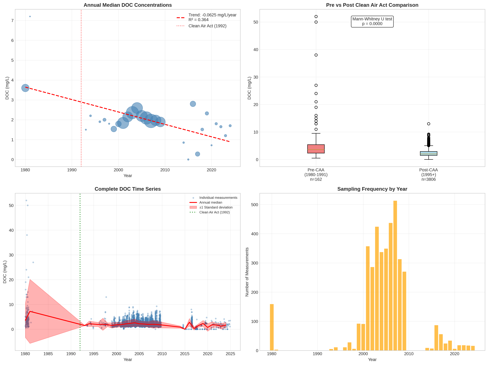

# Northern Allegheny Plateau - Detailed DOC Analysis

## Overview
- **Total Measurements**: 3,984
- **Monitoring Stations**: 193
- **Temporal Coverage**: 1980-2024
- **Median DOC**: 2.06 mg/L
- **Mean DOC**: 2.48 ± 2.00 mg/L

## Spatial Distribution

*Figure 1: Northern Allegheny Plateau monitoring stations colored by decade. The blue boundary shows the ecoregion extent with surrounding context.*

## Station Details

*Figure 2: Individual monitoring stations within Northern Allegheny Plateau. Marker size indicates number of measurements, color indicates median DOC concentration.*

## Temporal Analysis

*Figure 3: Comprehensive temporal analysis including annual trends, Clean Air Act comparison, seasonal patterns, and data coverage.*

## Statistical Summary

### DOC Distribution
- **Median**: 2.06 mg/L
- **25th Percentile**: 1.50 mg/L  
- **75th Percentile**: 3.00 mg/L
- **Standard Deviation**: 2.00 mg/L

### Clean Air Act Impact Analysis

- **Pre-CAA (1980-1991)**: 3.60 mg/L (n=162)
- **Post-CAA (1995+)**: 2.03 mg/L (n=3806)
- **Change**: -43.6%
- **Statistical Test**: **Statistically significant** (p = 0.0000)

### Long-term Trend Analysis

- **Trend**: decreasing at -0.0625 mg/L per year
- **R² Value**: 0.364
- **Statistical Significance**: **Statistically significant** (p = 0.0005)

---
*Generated on: 2025-08-14 09:53:38*
*Analysis period: 1980-2024*
