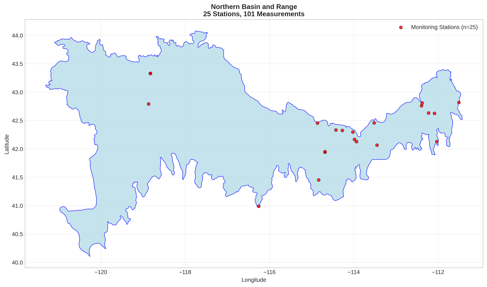
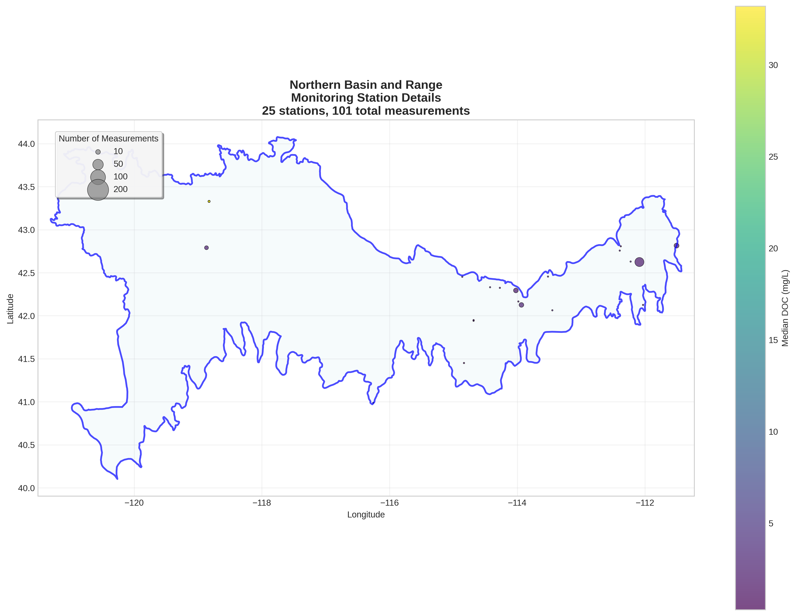
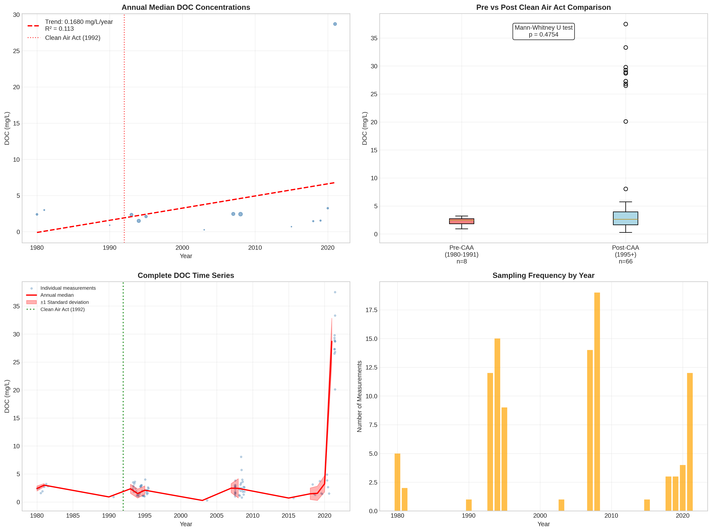

# Northern Basin and Range - Detailed DOC Analysis

## Overview
- **Total Measurements**: 101
- **Monitoring Stations**: 25
- **Temporal Coverage**: 1980-2021
- **Median DOC**: 2.40 mg/L
- **Mean DOC**: 5.44 ± 8.75 mg/L

## Spatial Distribution

*Figure 1: Northern Basin and Range monitoring stations colored by decade. The blue boundary shows the ecoregion extent with surrounding context.*

## Station Details

*Figure 2: Individual monitoring stations within Northern Basin and Range. Marker size indicates number of measurements, color indicates median DOC concentration.*

## Temporal Analysis

*Figure 3: Comprehensive temporal analysis including annual trends, Clean Air Act comparison, seasonal patterns, and data coverage.*

## Statistical Summary

### DOC Distribution
- **Median**: 2.40 mg/L
- **25th Percentile**: 1.54 mg/L  
- **75th Percentile**: 3.20 mg/L
- **Standard Deviation**: 8.75 mg/L

### Clean Air Act Impact Analysis

- **Pre-CAA (1980-1991)**: 2.45 mg/L (n=8)
- **Post-CAA (1995+)**: 2.61 mg/L (n=66)
- **Change**: 6.5%
- **Statistical Test**: Not statistically significant (p = 0.4754)

### Long-term Trend Analysis

- **Trend**: increasing at 0.1680 mg/L per year
- **R² Value**: 0.113
- **Statistical Significance**: Not statistically significant (p = 0.2408)

---
*Generated on: 2025-08-14 09:55:16*
*Analysis period: 1980-2021*
