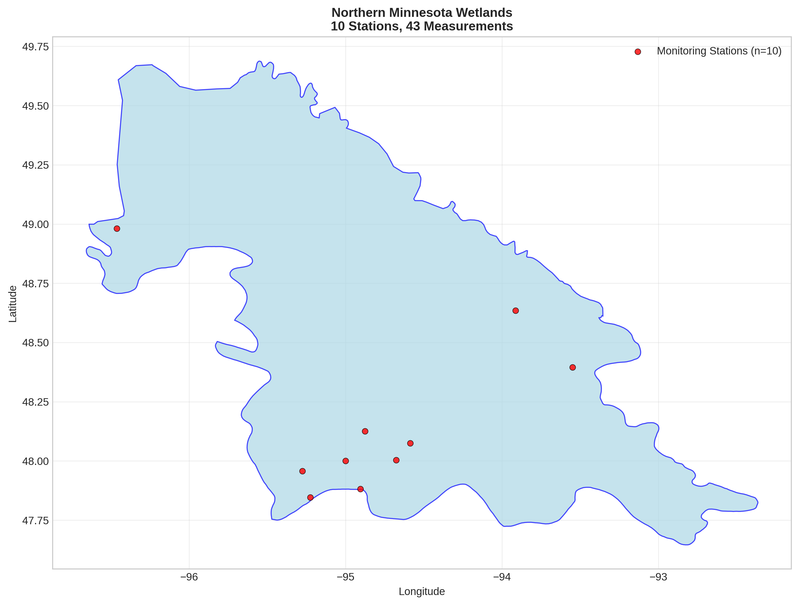
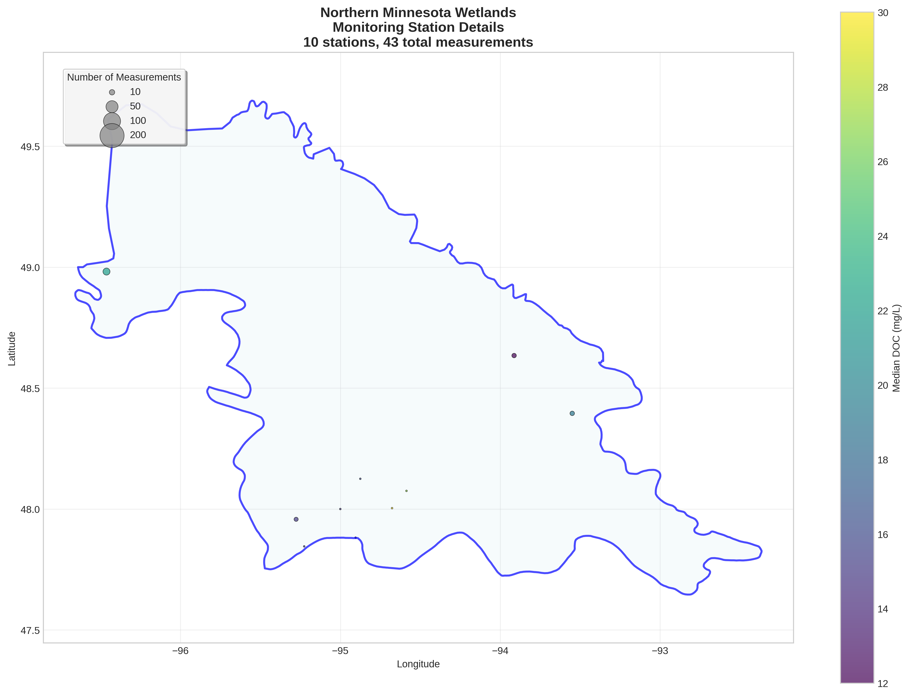
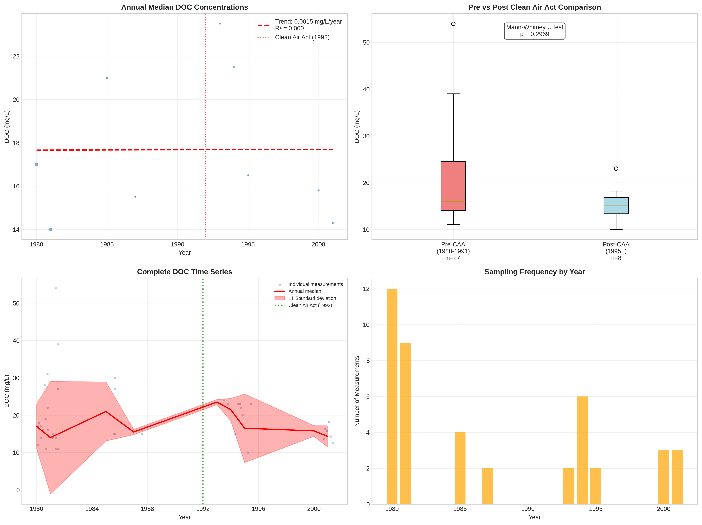

# Northern Minnesota Wetlands - Detailed DOC Analysis

## Overview
- **Total Measurements**: 43
- **Monitoring Stations**: 10
- **Temporal Coverage**: 1980-2001
- **Median DOC**: 16.30 mg/L
- **Mean DOC**: 19.37 ± 8.24 mg/L

## Spatial Distribution

*Figure 1: Northern Minnesota Wetlands monitoring stations colored by decade. The blue boundary shows the ecoregion extent with surrounding context.*

## Station Details

*Figure 2: Individual monitoring stations within Northern Minnesota Wetlands. Marker size indicates number of measurements, color indicates median DOC concentration.*

## Temporal Analysis

*Figure 3: Comprehensive temporal analysis including annual trends, Clean Air Act comparison, seasonal patterns, and data coverage.*

## Statistical Summary

### DOC Distribution
- **Median**: 16.30 mg/L
- **25th Percentile**: 14.15 mg/L  
- **75th Percentile**: 23.00 mg/L
- **Standard Deviation**: 8.24 mg/L

### Clean Air Act Impact Analysis

- **Pre-CAA (1980-1991)**: 16.00 mg/L (n=27)
- **Post-CAA (1995+)**: 15.05 mg/L (n=8)
- **Change**: -5.9%
- **Statistical Test**: Not statistically significant (p = 0.2969)

### Long-term Trend Analysis

- **Trend**: increasing at 0.0015 mg/L per year
- **R² Value**: 0.000
- **Statistical Significance**: Not statistically significant (p = 0.9930)

---
*Generated on: 2025-08-14 09:55:20*
*Analysis period: 1980-2001*
