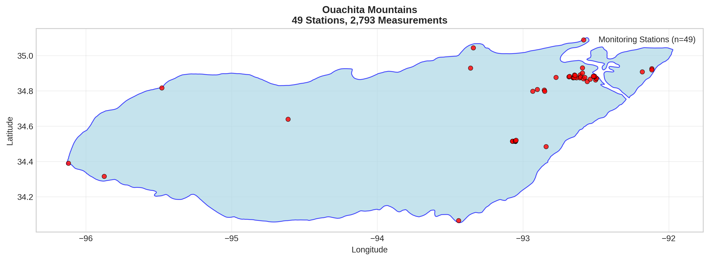
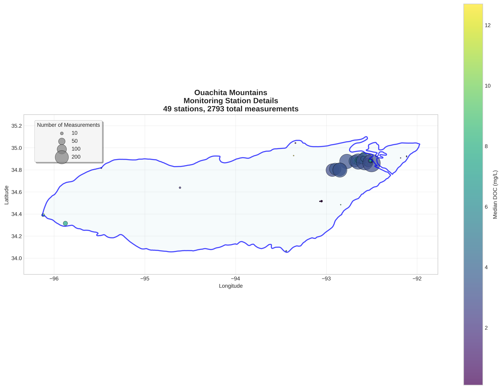
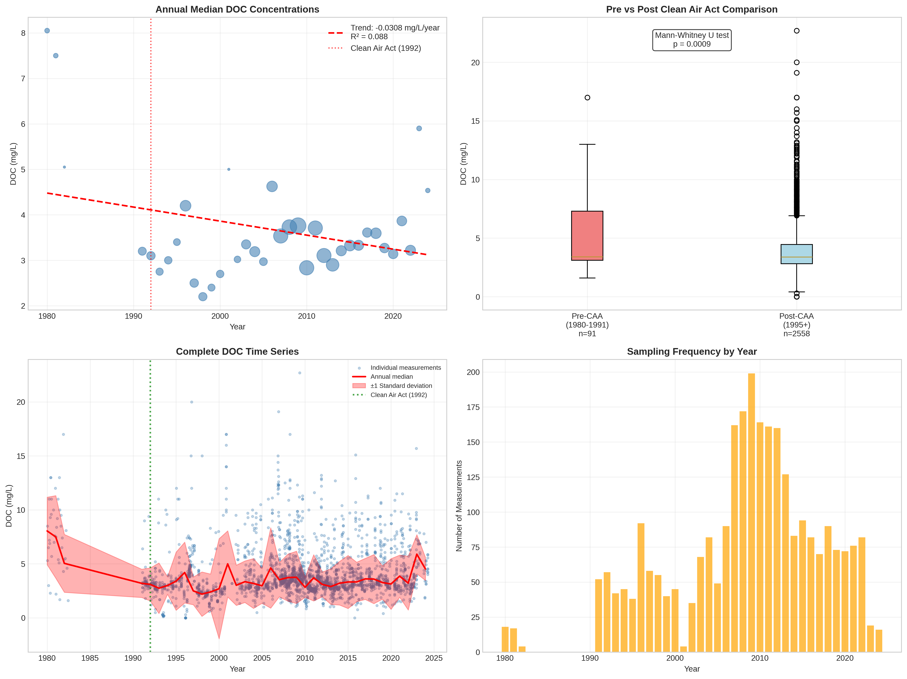

# Ouachita Mountains - Detailed DOC Analysis

## Overview
- **Total Measurements**: 2,793
- **Monitoring Stations**: 49
- **Temporal Coverage**: 1980-2024
- **Median DOC**: 3.34 mg/L
- **Mean DOC**: 4.02 ± 2.28 mg/L

## Spatial Distribution

*Figure 1: Ouachita Mountains monitoring stations colored by decade. The blue boundary shows the ecoregion extent with surrounding context.*

## Station Details

*Figure 2: Individual monitoring stations within Ouachita Mountains. Marker size indicates number of measurements, color indicates median DOC concentration.*

## Temporal Analysis

*Figure 3: Comprehensive temporal analysis including annual trends, Clean Air Act comparison, seasonal patterns, and data coverage.*

## Statistical Summary

### DOC Distribution
- **Median**: 3.34 mg/L
- **25th Percentile**: 2.80 mg/L  
- **75th Percentile**: 4.41 mg/L
- **Standard Deviation**: 2.28 mg/L

### Clean Air Act Impact Analysis

- **Pre-CAA (1980-1991)**: 3.40 mg/L (n=91)
- **Post-CAA (1995+)**: 3.38 mg/L (n=2558)
- **Change**: -0.4%
- **Statistical Test**: **Statistically significant** (p = 0.0009)

### Long-term Trend Analysis

- **Trend**: decreasing at -0.0308 mg/L per year
- **R² Value**: 0.088
- **Statistical Significance**: Not statistically significant (p = 0.0750)

---
*Generated on: 2025-08-14 09:53:56*
*Analysis period: 1980-2024*
