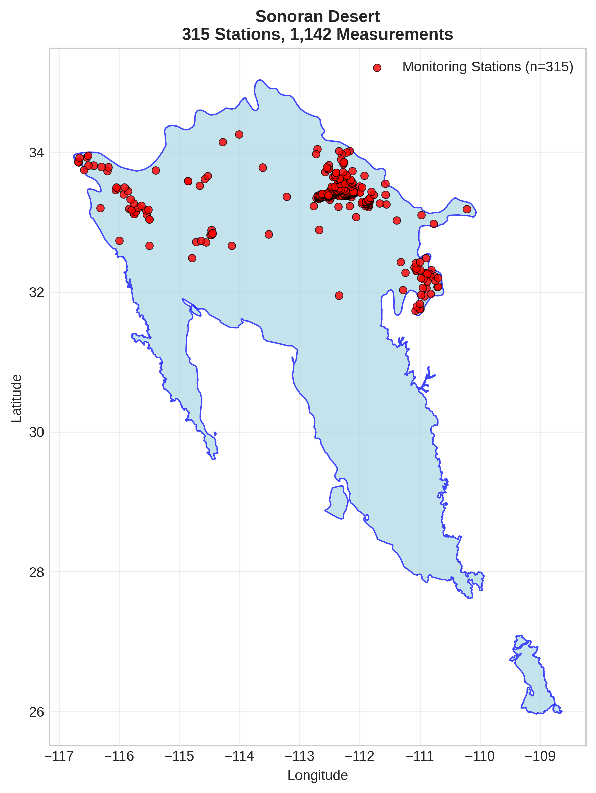
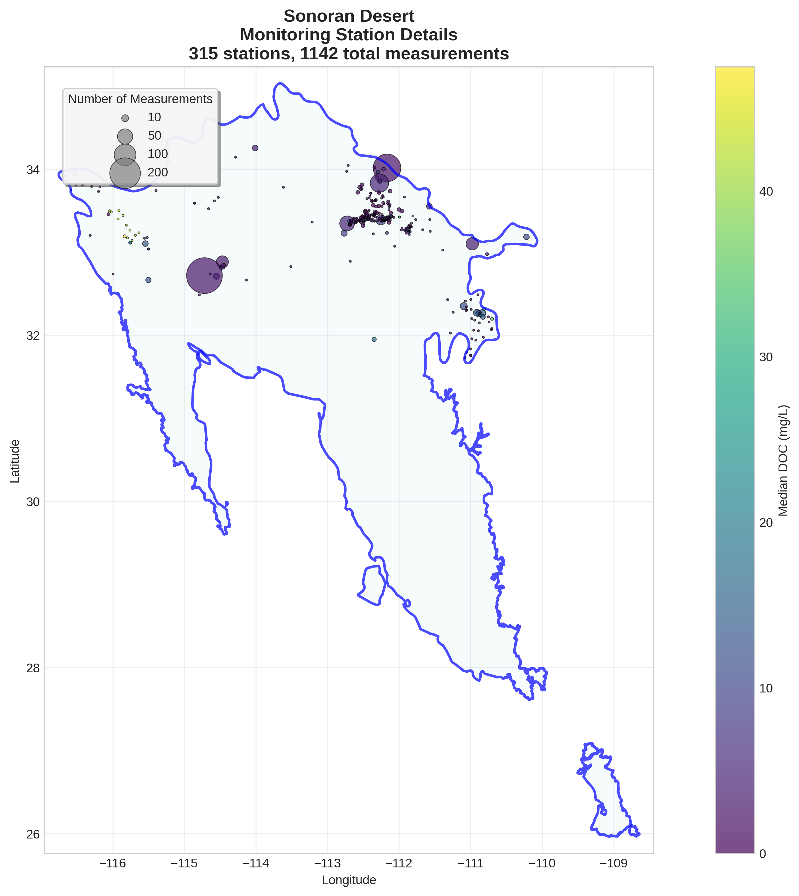
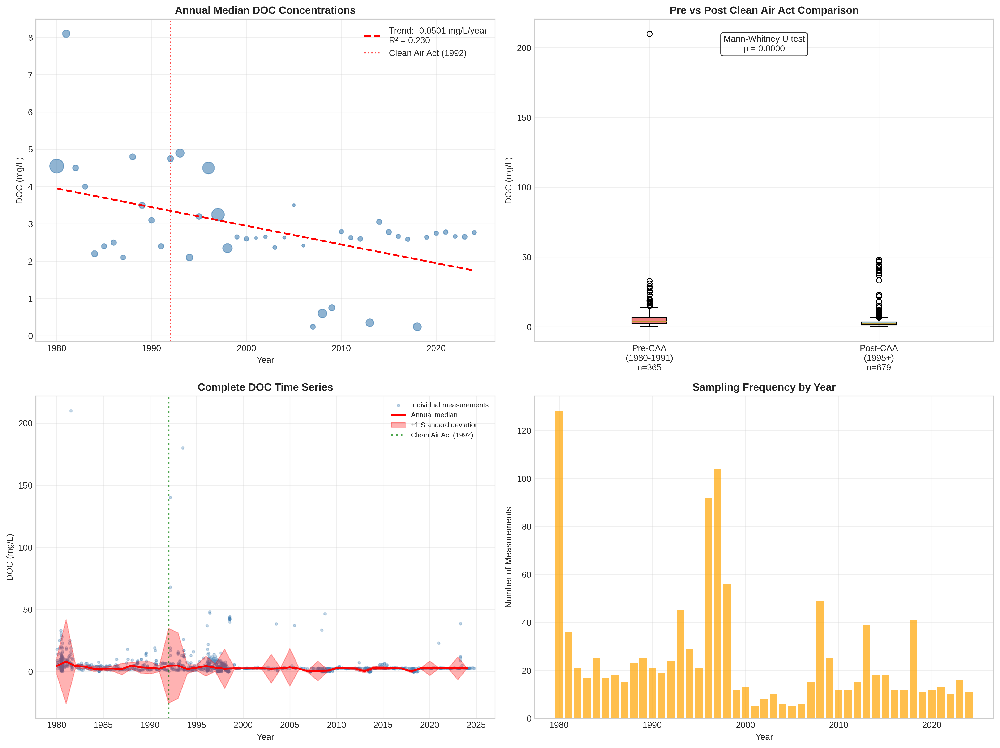

# Sonoran Desert - Detailed DOC Analysis

## Overview
- **Total Measurements**: 1,142
- **Monitoring Stations**: 315
- **Temporal Coverage**: 1980-2024
- **Median DOC**: 2.71 mg/L
- **Mean DOC**: 5.15 ± 11.09 mg/L

## Spatial Distribution

*Figure 1: Sonoran Desert monitoring stations colored by decade. The blue boundary shows the ecoregion extent with surrounding context.*

## Station Details

*Figure 2: Individual monitoring stations within Sonoran Desert. Marker size indicates number of measurements, color indicates median DOC concentration.*

## Temporal Analysis

*Figure 3: Comprehensive temporal analysis including annual trends, Clean Air Act comparison, seasonal patterns, and data coverage.*

## Statistical Summary

### DOC Distribution
- **Median**: 2.71 mg/L
- **25th Percentile**: 1.90 mg/L  
- **75th Percentile**: 5.00 mg/L
- **Standard Deviation**: 11.09 mg/L

### Clean Air Act Impact Analysis

- **Pre-CAA (1980-1991)**: 4.10 mg/L (n=365)
- **Post-CAA (1995+)**: 2.61 mg/L (n=679)
- **Change**: -36.3%
- **Statistical Test**: **Statistically significant** (p = 0.0000)

### Long-term Trend Analysis

- **Trend**: decreasing at -0.0501 mg/L per year
- **R² Value**: 0.230
- **Statistical Significance**: **Statistically significant** (p = 0.0009)

---
*Generated on: 2025-08-14 09:54:28*
*Analysis period: 1980-2024*
