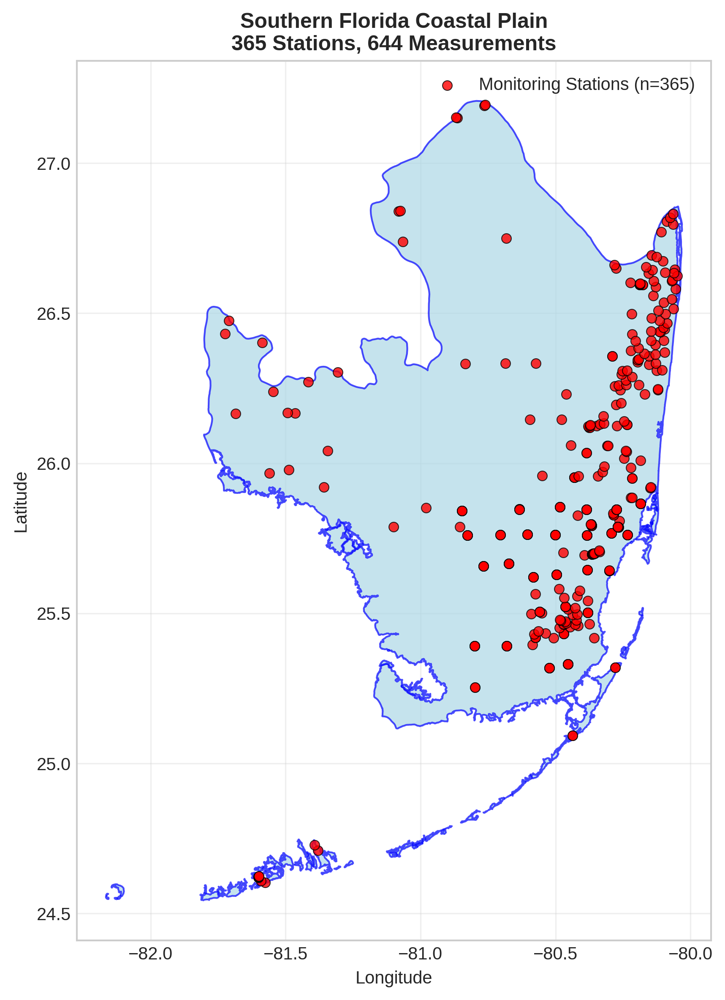
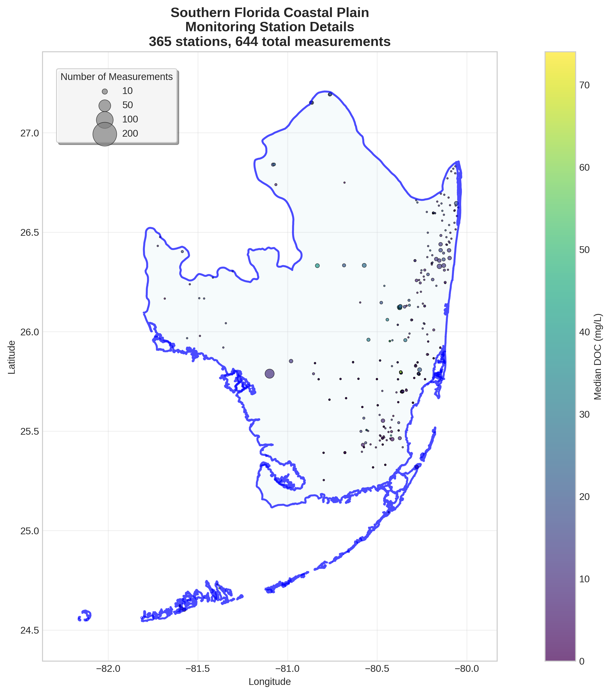
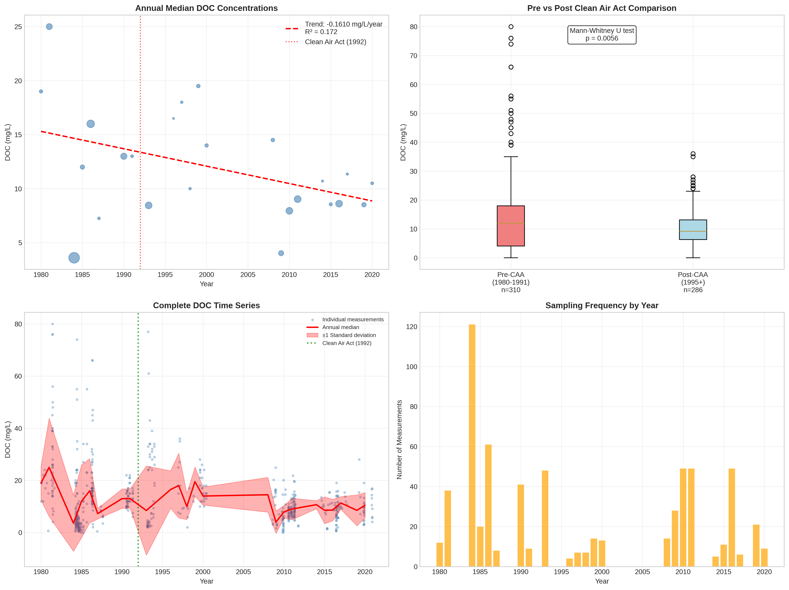

# Southern Florida Coastal Plain - Detailed DOC Analysis

## Overview
- **Total Measurements**: 644
- **Monitoring Stations**: 365
- **Temporal Coverage**: 1980-2020
- **Median DOC**: 9.91 mg/L
- **Mean DOC**: 12.64 ± 11.48 mg/L

## Spatial Distribution

*Figure 1: Southern Florida Coastal Plain monitoring stations colored by decade. The blue boundary shows the ecoregion extent with surrounding context.*

## Station Details

*Figure 2: Individual monitoring stations within Southern Florida Coastal Plain. Marker size indicates number of measurements, color indicates median DOC concentration.*

## Temporal Analysis

*Figure 3: Comprehensive temporal analysis including annual trends, Clean Air Act comparison, seasonal patterns, and data coverage.*

## Statistical Summary

### DOC Distribution
- **Median**: 9.91 mg/L
- **25th Percentile**: 5.37 mg/L  
- **75th Percentile**: 16.00 mg/L
- **Standard Deviation**: 11.48 mg/L

### Clean Air Act Impact Analysis

- **Pre-CAA (1980-1991)**: 12.00 mg/L (n=310)
- **Post-CAA (1995+)**: 9.19 mg/L (n=286)
- **Change**: -23.4%
- **Statistical Test**: **Statistically significant** (p = 0.0056)

### Long-term Trend Analysis

- **Trend**: decreasing at -0.1610 mg/L per year
- **R² Value**: 0.172
- **Statistical Significance**: **Statistically significant** (p = 0.0440)

---
*Generated on: 2025-08-14 09:54:45*
*Analysis period: 1980-2020*
