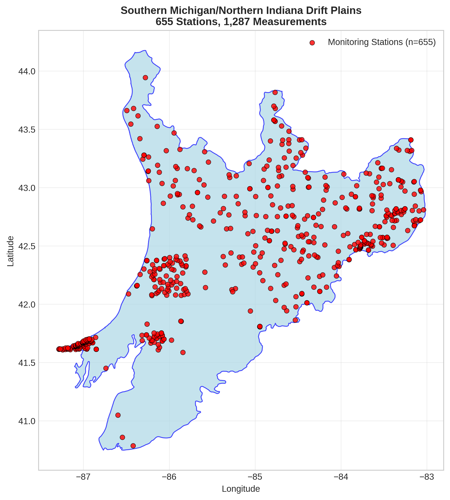
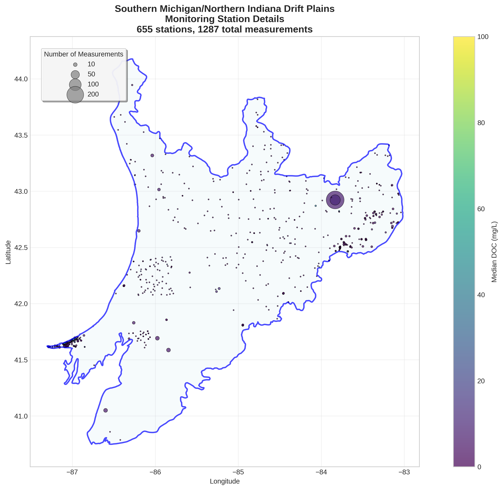
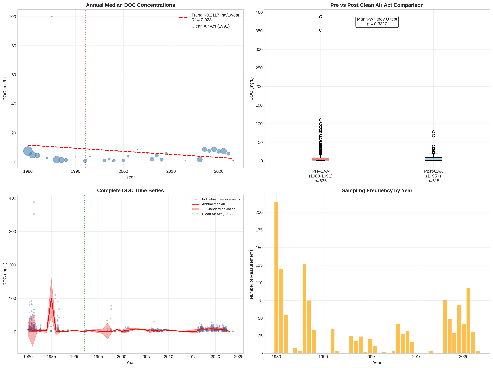

# Southern Michigan/Northern Indiana Drift Plains - Detailed DOC Analysis

## Overview
- **Total Measurements**: 1,287
- **Monitoring Stations**: 655
- **Temporal Coverage**: 1980-2023
- **Median DOC**: 3.80 mg/L
- **Mean DOC**: 7.48 ± 17.99 mg/L

## Spatial Distribution

*Figure 1: Southern Michigan/Northern Indiana Drift Plains monitoring stations colored by decade. The blue boundary shows the ecoregion extent with surrounding context.*

## Station Details

*Figure 2: Individual monitoring stations within Southern Michigan/Northern Indiana Drift Plains. Marker size indicates number of measurements, color indicates median DOC concentration.*

## Temporal Analysis

*Figure 3: Comprehensive temporal analysis including annual trends, Clean Air Act comparison, seasonal patterns, and data coverage.*

## Statistical Summary

### DOC Distribution
- **Median**: 3.80 mg/L
- **25th Percentile**: 1.20 mg/L  
- **75th Percentile**: 8.45 mg/L
- **Standard Deviation**: 17.99 mg/L

### Clean Air Act Impact Analysis

- **Pre-CAA (1980-1991)**: 2.90 mg/L (n=635)
- **Post-CAA (1995+)**: 4.90 mg/L (n=615)
- **Change**: 69.0%
- **Statistical Test**: Not statistically significant (p = 0.3310)

### Long-term Trend Analysis

- **Trend**: decreasing at -0.2117 mg/L per year
- **R² Value**: 0.028
- **Statistical Significance**: Not statistically significant (p = 0.3580)

---
*Generated on: 2025-08-14 09:54:22*
*Analysis period: 1980-2023*
