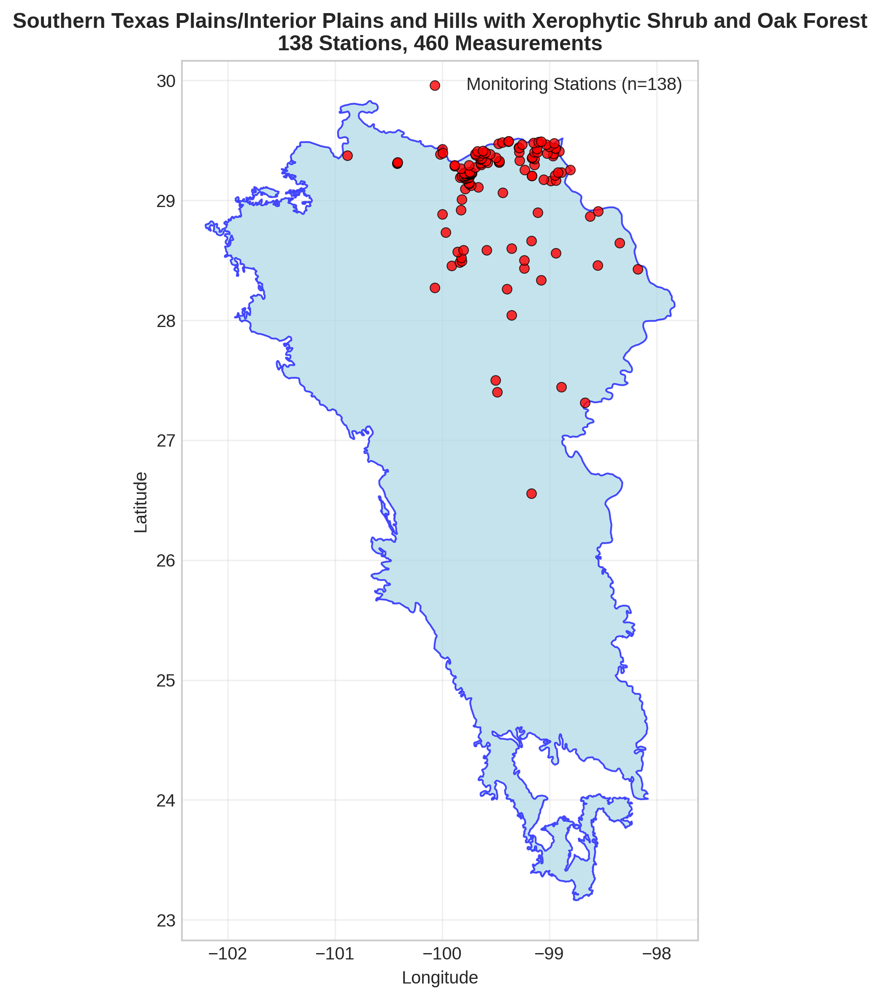
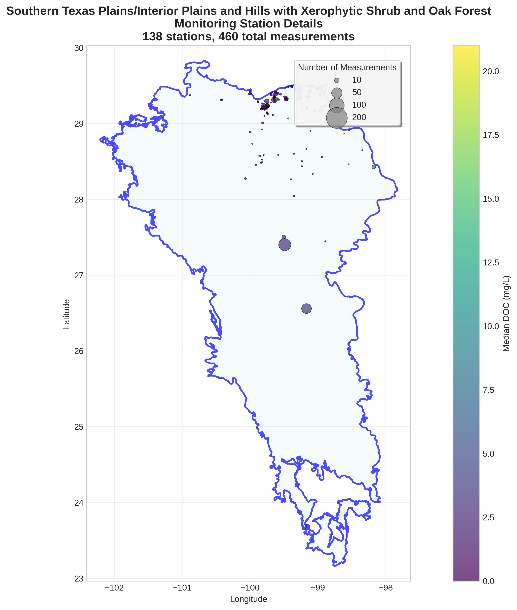
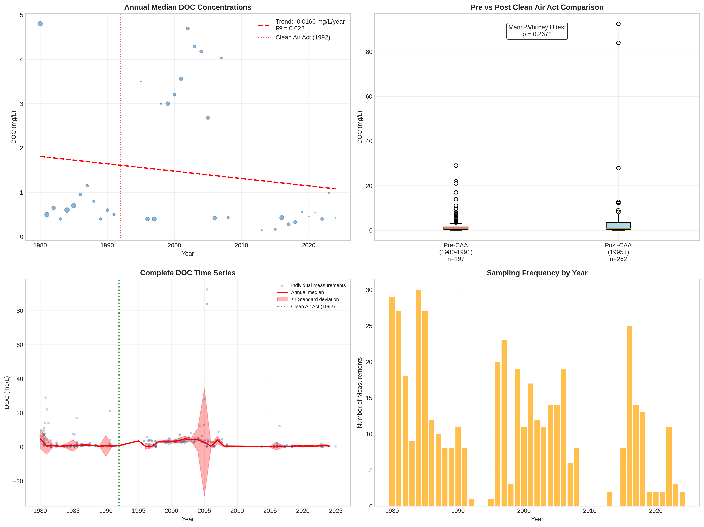

# Southern Texas Plains/Interior Plains and Hills with Xerophytic Shrub and Oak Forest - Detailed DOC Analysis

## Overview
- **Total Measurements**: 460
- **Monitoring Stations**: 138
- **Temporal Coverage**: 1980-2024
- **Median DOC**: 0.73 mg/L
- **Mean DOC**: 2.40 ± 6.52 mg/L

## Spatial Distribution

*Figure 1: Southern Texas Plains/Interior Plains and Hills with Xerophytic Shrub and Oak Forest monitoring stations colored by decade. The blue boundary shows the ecoregion extent with surrounding context.*

## Station Details

*Figure 2: Individual monitoring stations within Southern Texas Plains/Interior Plains and Hills with Xerophytic Shrub and Oak Forest. Marker size indicates number of measurements, color indicates median DOC concentration.*

## Temporal Analysis

*Figure 3: Comprehensive temporal analysis including annual trends, Clean Air Act comparison, seasonal patterns, and data coverage.*

## Statistical Summary

### DOC Distribution
- **Median**: 0.73 mg/L
- **25th Percentile**: 0.40 mg/L  
- **75th Percentile**: 3.00 mg/L
- **Standard Deviation**: 6.52 mg/L

### Clean Air Act Impact Analysis

- **Pre-CAA (1980-1991)**: 0.70 mg/L (n=197)
- **Post-CAA (1995+)**: 0.79 mg/L (n=262)
- **Change**: 12.9%
- **Statistical Test**: Not statistically significant (p = 0.2678)

### Long-term Trend Analysis

- **Trend**: decreasing at -0.0166 mg/L per year
- **R² Value**: 0.022
- **Statistical Significance**: Not statistically significant (p = 0.3705)

---
*Generated on: 2025-08-14 09:54:50*
*Analysis period: 1980-2024*
