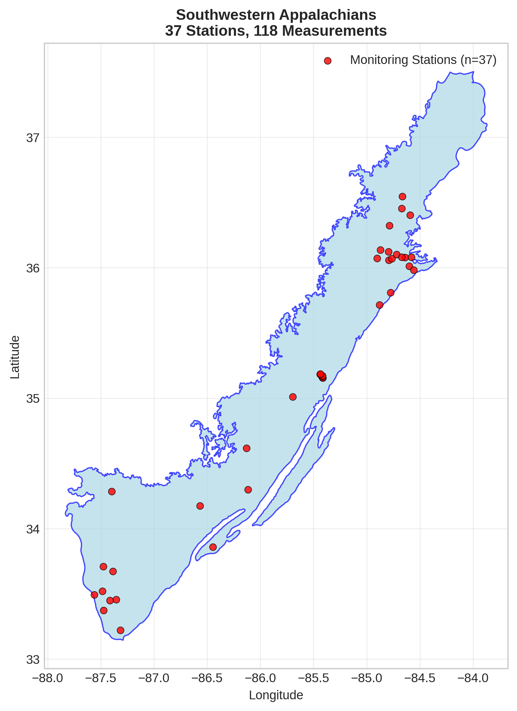
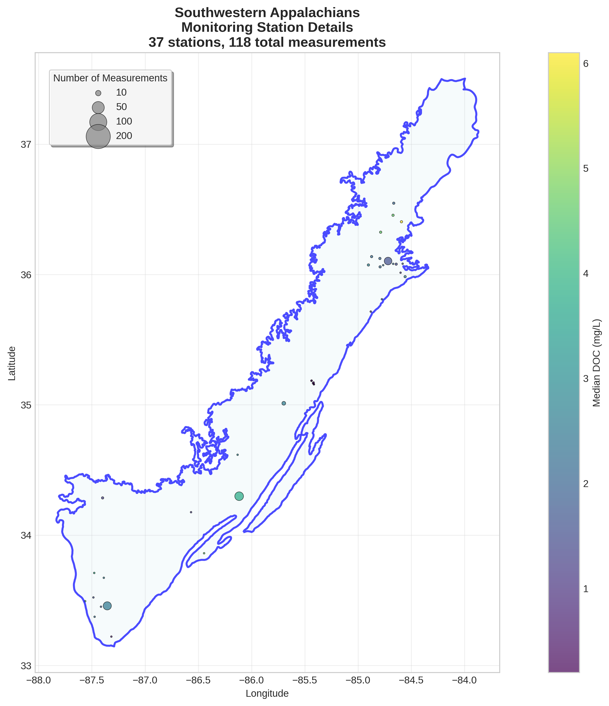
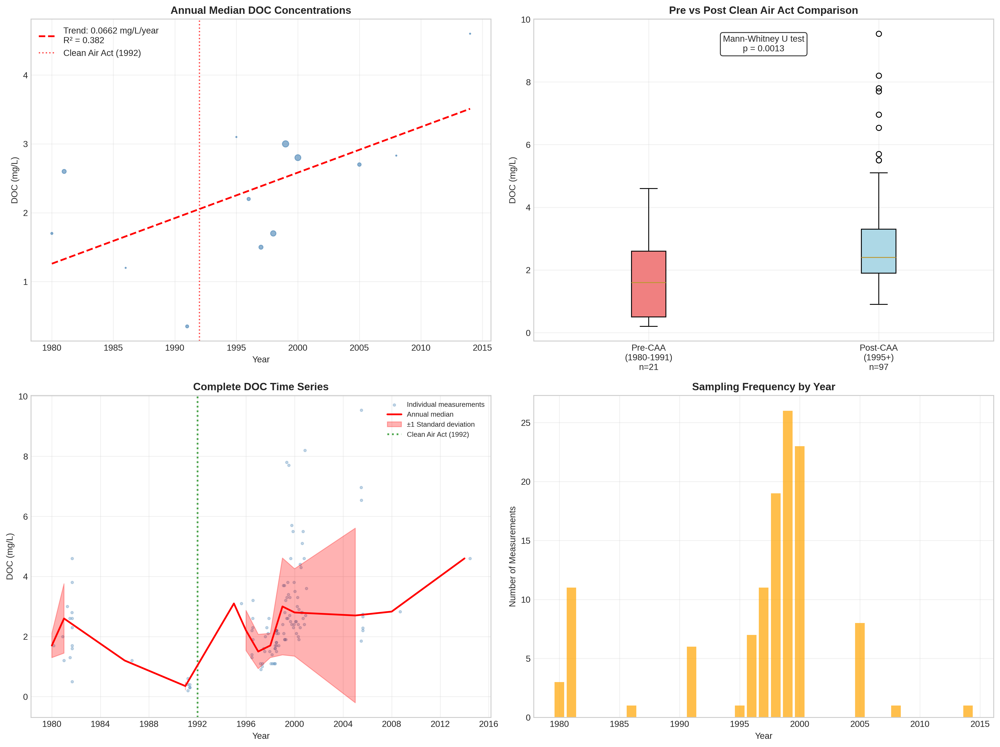

# Southwestern Appalachians - Detailed DOC Analysis

## Overview
- **Total Measurements**: 118
- **Monitoring Stations**: 37
- **Temporal Coverage**: 1980-2014
- **Median DOC**: 2.30 mg/L
- **Mean DOC**: 2.65 ± 1.65 mg/L

## Spatial Distribution

*Figure 1: Southwestern Appalachians monitoring stations colored by decade. The blue boundary shows the ecoregion extent with surrounding context.*

## Station Details

*Figure 2: Individual monitoring stations within Southwestern Appalachians. Marker size indicates number of measurements, color indicates median DOC concentration.*

## Temporal Analysis

*Figure 3: Comprehensive temporal analysis including annual trends, Clean Air Act comparison, seasonal patterns, and data coverage.*

## Statistical Summary

### DOC Distribution
- **Median**: 2.30 mg/L
- **25th Percentile**: 1.70 mg/L  
- **75th Percentile**: 3.08 mg/L
- **Standard Deviation**: 1.65 mg/L

### Clean Air Act Impact Analysis

- **Pre-CAA (1980-1991)**: 1.60 mg/L (n=21)
- **Post-CAA (1995+)**: 2.40 mg/L (n=97)
- **Change**: 50.0%
- **Statistical Test**: **Statistically significant** (p = 0.0013)

### Long-term Trend Analysis

- **Trend**: increasing at 0.0662 mg/L per year
- **R² Value**: 0.382
- **Statistical Significance**: **Statistically significant** (p = 0.0243)

---
*Generated on: 2025-08-14 09:55:14*
*Analysis period: 1980-2014*
