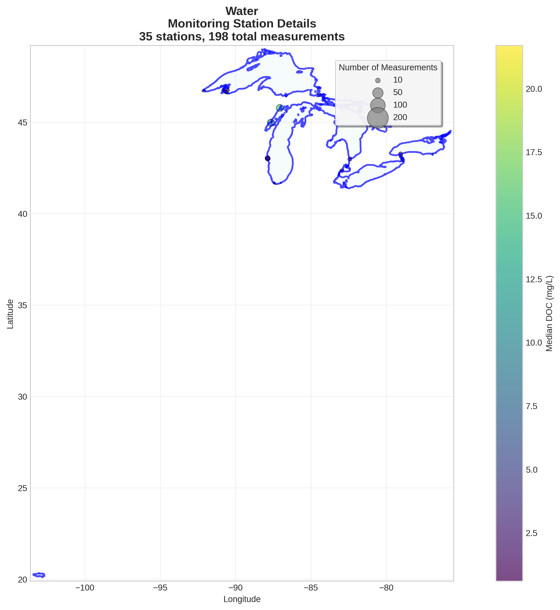

# Water - Detailed DOC Analysis

## Overview
- **Total Measurements**: 198
- **Monitoring Stations**: 35
- **Temporal Coverage**: 1980-2017
- **Median DOC**: 2.70 mg/L
- **Mean DOC**: 5.54 ± 5.56 mg/L

## Spatial Distribution

*Figure 1: Water monitoring stations colored by decade. The blue boundary shows the ecoregion extent with surrounding context.*

## Station Details

*Figure 2: Individual monitoring stations within Water. Marker size indicates number of measurements, color indicates median DOC concentration.*

## Temporal Analysis

*Figure 3: Comprehensive temporal analysis including annual trends, Clean Air Act comparison, seasonal patterns, and data coverage.*

## Statistical Summary

### DOC Distribution
- **Median**: 2.70 mg/L
- **25th Percentile**: 1.91 mg/L  
- **75th Percentile**: 7.35 mg/L
- **Standard Deviation**: 5.56 mg/L

### Clean Air Act Impact Analysis

- **Pre-CAA (1980-1991)**: 7.75 mg/L (n=84)
- **Post-CAA (1995+)**: 2.21 mg/L (n=114)
- **Change**: -71.5%
- **Statistical Test**: **Statistically significant** (p = 0.0000)

### Long-term Trend Analysis

- **Trend**: increasing at 0.1400 mg/L per year
- **R² Value**: 0.085
- **Statistical Significance**: Not statistically significant (p = 0.2393)

---
*Generated on: 2025-08-14 09:55:09*
*Analysis period: 1980-2017*
