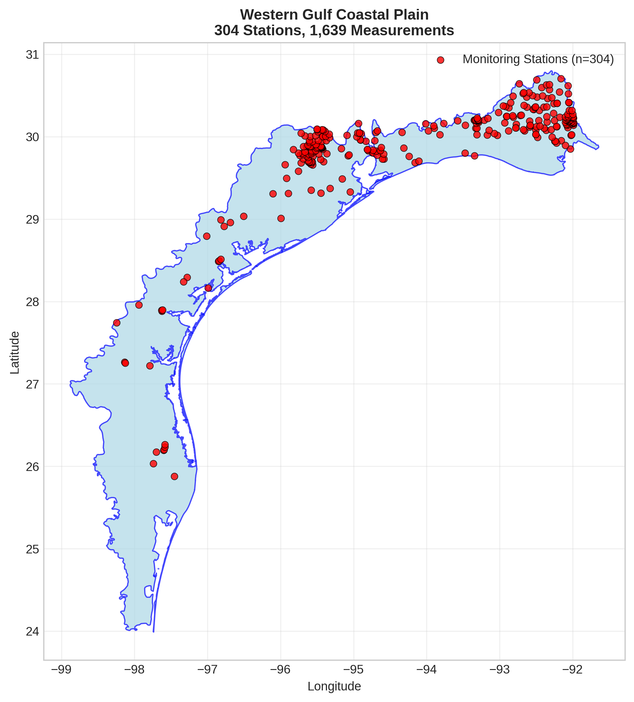
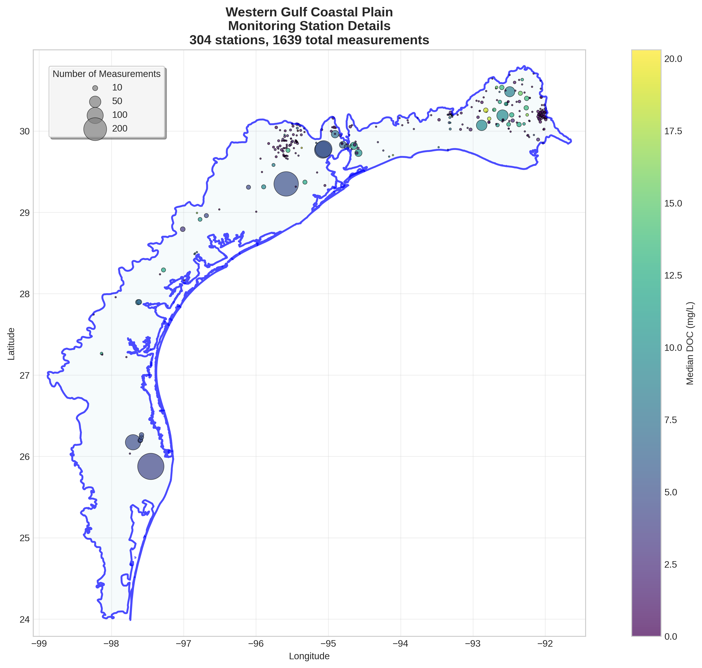
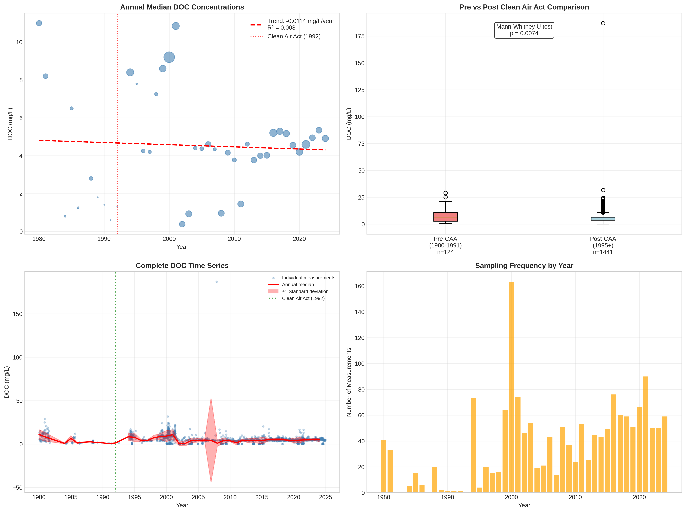

# Western Gulf Coastal Plain - Detailed DOC Analysis

## Overview
- **Total Measurements**: 1,639
- **Monitoring Stations**: 304
- **Temporal Coverage**: 1980-2024
- **Median DOC**: 4.76 mg/L
- **Mean DOC**: 5.62 ± 6.17 mg/L

## Spatial Distribution

*Figure 1: Western Gulf Coastal Plain monitoring stations colored by decade. The blue boundary shows the ecoregion extent with surrounding context.*

## Station Details

*Figure 2: Individual monitoring stations within Western Gulf Coastal Plain. Marker size indicates number of measurements, color indicates median DOC concentration.*

## Temporal Analysis

*Figure 3: Comprehensive temporal analysis including annual trends, Clean Air Act comparison, seasonal patterns, and data coverage.*

## Statistical Summary

### DOC Distribution
- **Median**: 4.76 mg/L
- **25th Percentile**: 3.50 mg/L  
- **75th Percentile**: 6.99 mg/L
- **Standard Deviation**: 6.17 mg/L

### Clean Air Act Impact Analysis

- **Pre-CAA (1980-1991)**: 5.85 mg/L (n=124)
- **Post-CAA (1995+)**: 4.70 mg/L (n=1441)
- **Change**: -19.7%
- **Statistical Test**: **Statistically significant** (p = 0.0074)

### Long-term Trend Analysis

- **Trend**: decreasing at -0.0114 mg/L per year
- **R² Value**: 0.003
- **Statistical Significance**: Not statistically significant (p = 0.7425)

---
*Generated on: 2025-08-14 09:54:17*
*Analysis period: 1980-2024*
