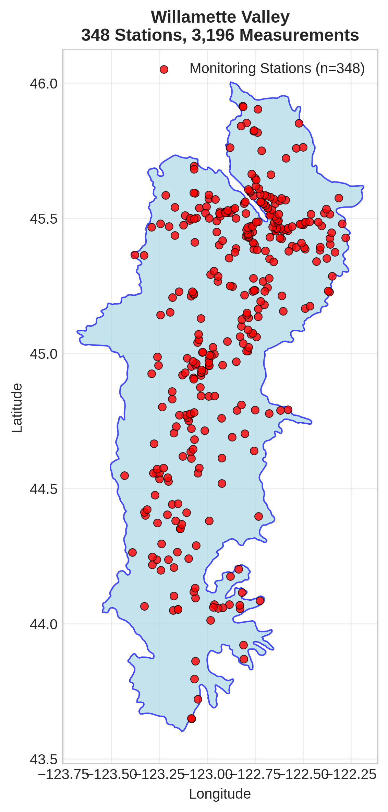
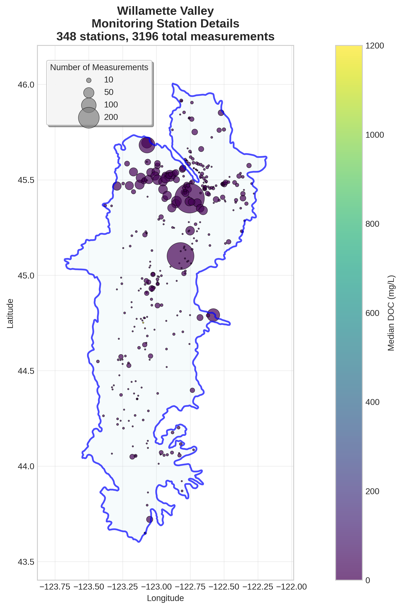
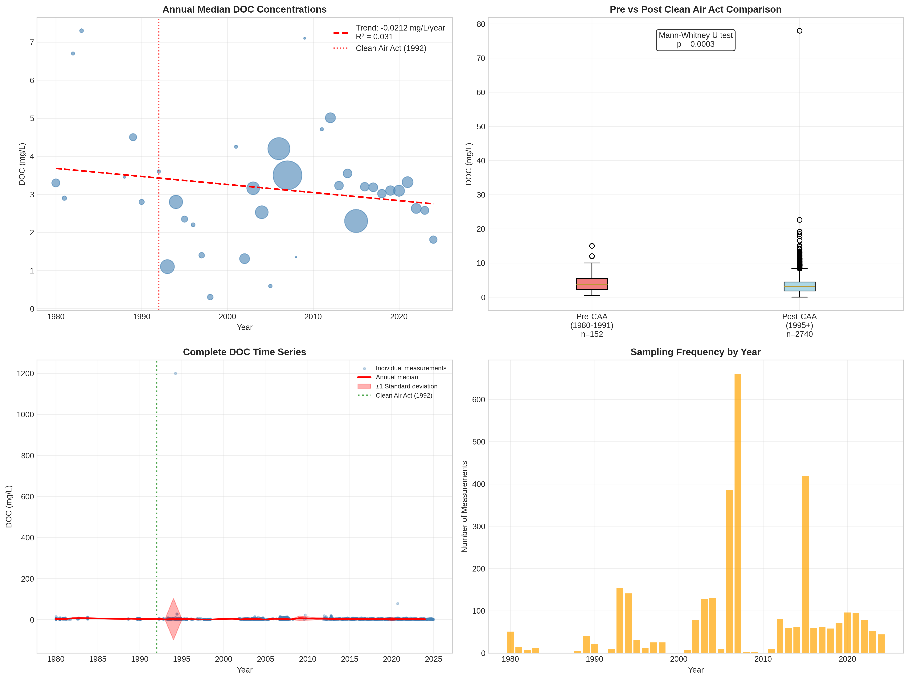

# Willamette Valley - Detailed DOC Analysis

## Overview
- **Total Measurements**: 3,196
- **Monitoring Stations**: 348
- **Temporal Coverage**: 1980-2024
- **Median DOC**: 3.02 mg/L
- **Mean DOC**: 3.86 ± 21.35 mg/L

## Spatial Distribution

*Figure 1: Willamette Valley monitoring stations colored by decade. The blue boundary shows the ecoregion extent with surrounding context.*

## Station Details

*Figure 2: Individual monitoring stations within Willamette Valley. Marker size indicates number of measurements, color indicates median DOC concentration.*

## Temporal Analysis

*Figure 3: Comprehensive temporal analysis including annual trends, Clean Air Act comparison, seasonal patterns, and data coverage.*

## Statistical Summary

### DOC Distribution
- **Median**: 3.02 mg/L
- **25th Percentile**: 1.70 mg/L  
- **75th Percentile**: 4.41 mg/L
- **Standard Deviation**: 21.35 mg/L

### Clean Air Act Impact Analysis

- **Pre-CAA (1980-1991)**: 3.75 mg/L (n=152)
- **Post-CAA (1995+)**: 3.10 mg/L (n=2740)
- **Change**: -17.3%
- **Statistical Test**: **Statistically significant** (p = 0.0003)

### Long-term Trend Analysis

- **Trend**: decreasing at -0.0212 mg/L per year
- **R² Value**: 0.031
- **Statistical Significance**: Not statistically significant (p = 0.3000)

---
*Generated on: 2025-08-14 09:53:48*
*Analysis period: 1980-2024*
